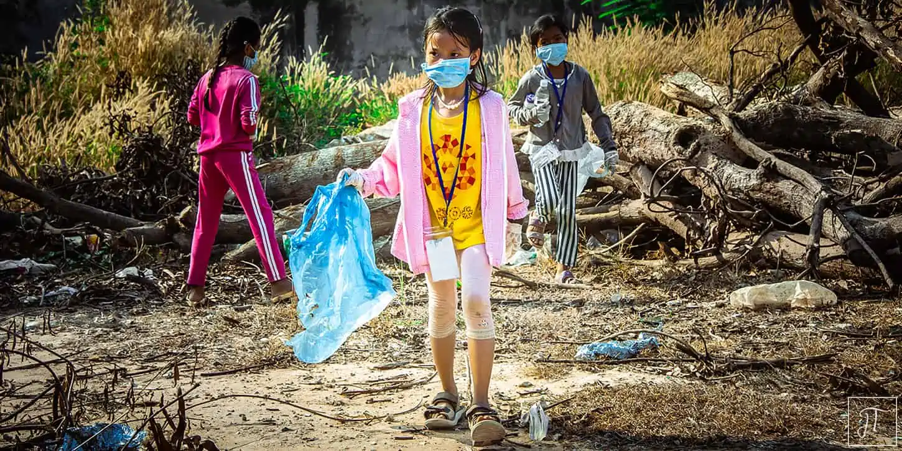
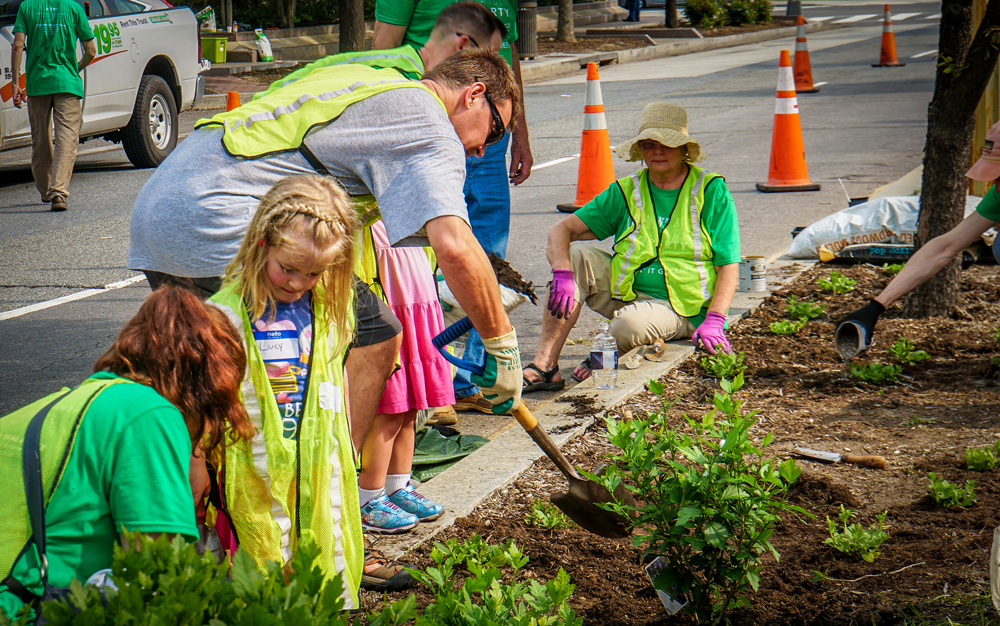
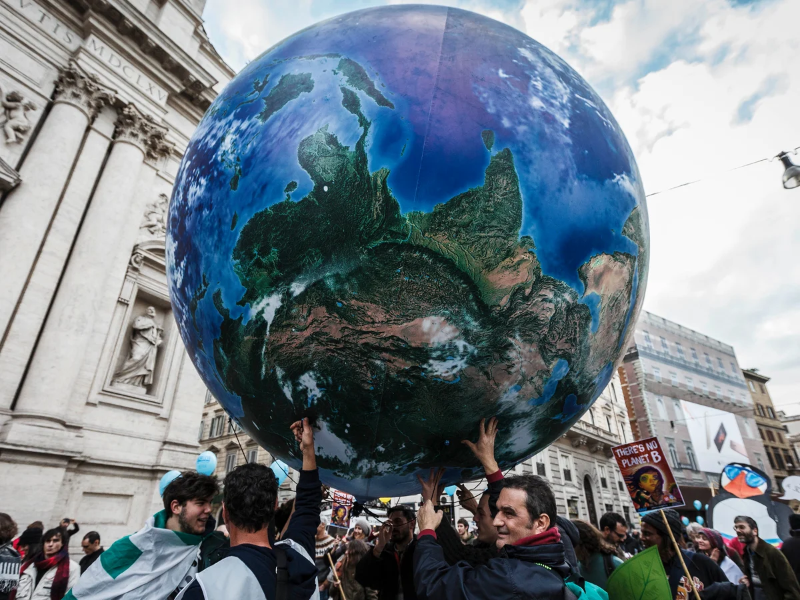

<link rel="stylesheet" href="css/styles.css">

<!-- Navbar HTML Structure -->

    <!-- Left-side navbar content (empty for now) -->
    

    

        <a href="extremeWeather">Extreme Weather</a>
        <a href="mainMap">Surface Temperature</a>
        <a href="ozone">Ozone Layer</a>
        <a href="stackedArea">Energy Sources</a>
        <a href="otherVisualizations">Other Visualizations</a>
        <a href="action" id="action">Take Action</a>
    

    
<h2>Take Action</h2>
 
<h1 style="font-size: 3em;">What can I do to help?</h1>
 

    

        <h2>Individual</h2> 
      <h1>Get Excited and get involved</h1> 
      

        Identify what your skills and interests are. Think about how you can affect change in your field.  
        Vote for government officials that have climate change policies.  
        Make changes in your daily routine, such as eating less beef, carpool, or travel less to reduce your carbon footprint. 
      

    

    

      
    

  

      
  <!-- -->

  

    

        
    

    

      <h2>Community</h2> 
      <h1>Make an impact in your community</h1> 
      

        Working as a community makes a greater impact.  
        Consider getting involved in climate change initiatives within your community.  
        Take part in climate-related volunteering opportunities or protests. 
      

    

  

      
  <!-- -->

  

    

        <h2>Global</h2> 
      <h1>Work towards a better future</h1> 
      

        Stay informed on environmental issues, both within your community and globally.  
        Participate in efforts to put pressure on governments, corporations, etc. To enhance their responses to climate change  
      

    

    

      
    

  

      

