<!-- NOTE: for class presentation, photos are temporary, chosen by DESN students, references will be added later -->

<link rel="stylesheet" href="css/styles.css">

<!-- Navbar HTML Structure -->
<div class="navbar">
    <!-- Left-side navbar content (empty for now) -->
    <div class="logo"><a href="index">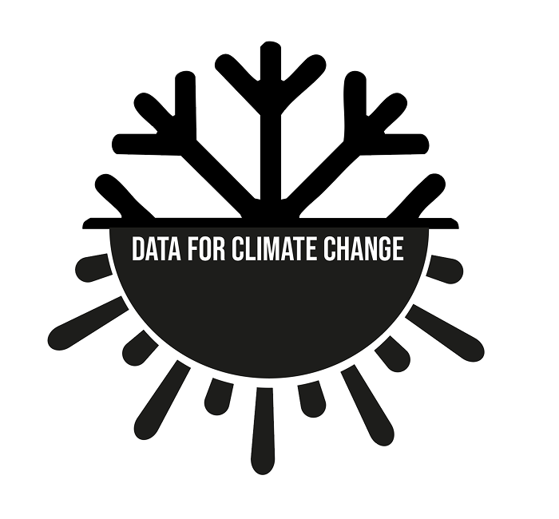</a></div>
    <div>
        <a href="extremeWeather">Extreme Weather</a>
        <a href="mainMap">Surface Temperature</a>
        <a href="ozone">Ozone Layer</a>
        <a href="stackedArea">Energy Sources</a>
        <a href="otherVisualizations">Other Visualizations</a>
        <a href="action" id="action">Take Action</a>
    </div>
</div>


<div class="weather-hero">
    <h1>Extreme Weather Events</h1>
</div>


<!-- Load Icons for Hover -->
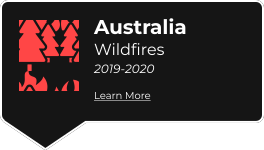
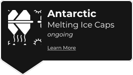

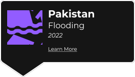


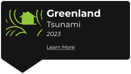
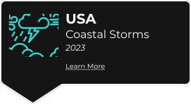
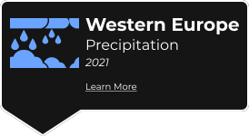

<!-- Load Images for Pop-up -->
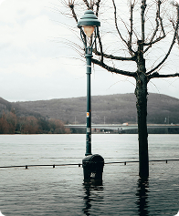
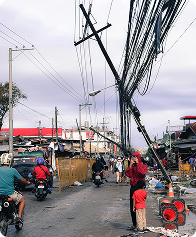
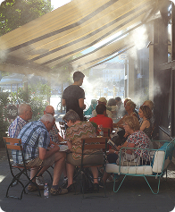

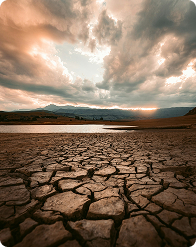

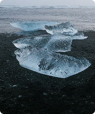
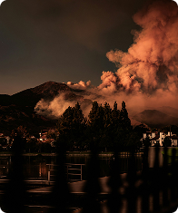

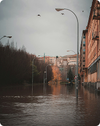
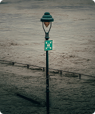


```js
import { Runtime, Inspector } from "https://cdn.jsdelivr.net/npm/@observablehq/runtime@4/dist/runtime.js";

const antarctic_extent = await FileAttachment("/data/ice_extent/Antarctic-data.csv").csv();

const width = 800;
async function loadWorldMap() {
    const world = await fetch(import.meta.resolve("npm:world-atlas/land-110m.json")).then(r => r.json());
    return topojson.feature(world, world.objects.land);
}


const locations = [
    { name: "Floods", lon: 68.7356, lat: 26.3747, type: "FLOOD", brief: "2022 | Pakistan | 1/3 of the Country | 1,739 Deaths | 33 Million Affected | Damages: $40 Billion (Estimated USD)",
    info: "<hr>Heavy monsoon rains caused widespread flooding in Pakistan. Model-based analysis confirms that [the trend in cross-equatorial moisture transport] is consistent with the fingerprint of anthropogenic climate warming. <br><br> The 2022 floods in Pakistan resulted in devastating loss of life, displacement of millions, and significant damage to infrastructure and agriculture, exacerbating an already challenging humanitarian situation in the region. ", reference: "You Y. et al., (2024) Climate warming contributes to the record-shattering 2022 Pakistan rainfall, npj Climate and Atmospheric Science, doi:10.1038/s41612-024-00630-4", imgCitation: "" },
    { name: "Heat Waves", lon: -2.0000, lat: 52.0000, type: "HEAT", brief: "2022 | United Kingdom | Highest Recorded Temperature 40.3°C | 2,985 Excess Deaths in Summer of 2022",
    info: "<hr>Human-caused climate change made the event at least 10 times more likely. In observational analysis and study models, the same event would be about 2C less hot in a 1.2°C cooler world. <br><br>On July 19, the heat reached 40.3°C (104.5°F), the hottest ever recorded in the UK,  resulting in around 1,700 excess deaths, mainly among vulnerable individuals.", reference: "Zachariah, M. et al., (2022). Without human-caused climate change temperatures of 40°C in the UK would have been extremely unlikely, World Weather Attribution", imgCitation: "" },
    { name: "Tsunami", lon: -26.9650, lat: 72.8170, type: "TSUNAMI", brief: "2023 | Greenland | Global Siesmic Vibrations for Nine Days | 200m High Waves",
    info: "<hr>Greenland tsunami was triggered by a series of factors, including the melting glacial ice due to global warming. Greenland, being highly sensitive to rising temperatures, has experienced accelerated glacial retreat and destabilization in recent years, making landslides more frequent and severe. The event started a seismic vibration that was detectable around the world for over a week.", reference: "Svennevig K. et al. ,A rockslide-generated tsunami in a Greenland fjord rang Earth for 9 days. Science. 385,1196-1205(2024).DOI:10.1126/science.adm9247", imgCitation: "" },
    { name: "Drought", lon: 38.0000, lat: 8.0000, type: "DROUGHT", brief: "2017 | East Africa: Ethiopia, Kenya, Somalia, South Sudan | 40°C Recorded Temperatures | 10,000+ Deaths | 23 Million Left in Urgent Need of Food, Water, and Medical Treatment",
    info: "<hr>Anthropogenic warming of Western V sea surface temperatures contributed to East African drought. Extremely warm (FAR = 1) Western V SST doubled the probability of drought, contributing to widespread food insecurity. <br><br>The 2017 East African drought impacted millions across countries like Somalia and Ethiopia, leading to severe food insecurity and malnutrition. Estimates suggest that tens of thousands lost their lives due to famine and related health issues.", reference: "Funk, C. et al. 2018: Examining the Potential Contributions of Extreme “Western v” Sea Surface Temperatures to the 2017 March–June East African Drought. Explaining Extreme Events of 2017 from a Climate Perspective. Bull. Amer. Meteor. Soc., doi:10.1175/BAMS-D-18-0108.1", imgCitation: "" },
    { name: "Coastal Storms", lon: -80.0000, lat: 35.0000, type: "COASTAL", brief: "2024 | Catastrophic Helene Rainfall | United States | 249 Deaths",
    info: "<hr>Anthropogenic climate change causing warmer ocean and air temperatures has lead to an increase in the intensity of hurricanes. Sea level rise has also made coastal storms more damaging, in the last century, sea levels have already rose more than half a foot, a trend expected to more than double to between 1 and 2.5 feet in the current century.<br><br>In a 1.5°C warming world, these events are more common, more severe, and more deadly. Hurricane Helene was the deadliest hurricane in the contiguous United States since Katrina (2005).", reference: "Clarke, B. et al., (2024). Climate change key driver of catastrophic impacts of Hurricane Helene that devastated both coastal and inland communities. spiral.imperial.ac.uk. https://doi.org/10.25561/115024", imgCitation: "" },
    { name: "Rising Sea Levels", lon: -52.5055, lat: -32.0260, type: "RISINGSEA", brief: "2024 | Rio Grande do Sul, Brazil | 181 Deaths | 2.4 Million Affected | Damages: $3.7 Billion (Estimated USD)",
    info: "<hr>In 2024, the state of Rio Grande do Sul in Brazil saw massive flooding caused by heavy rain and storms. These floods have bee exacerbated by climate change and El Niño, alongside the rising water levels that have lead to even more displacement and destruction. <br><br>According to the 2023 IPCC report, relative sea levels in the South Atlantic have increased at a higher rate than the global mean. This trend is extremely likely to continue, contributing to increased coastal flooding and shoreline retreat.", reference: "IPCC, (2023). Regional fact sheet -- Central and South America. Sixth Assessment Report. https://www.ipcc.ch/report/ar6/wg1/downloads/factsheets/IPCC_AR6_WGI_Regional_Fact_Sheet_Central_and_South_America.pdf", imgCitation: "" },
    { name: "Precipitation", lon: 10.0000, lat: 48.0000, type: "PRECIP", brief: "2021 | Western Europe | 300mm in 24 Hours | 243 Deaths | Damages: $35 Billion (Estimated USD)", info: "<hr>Extreme rainfall over the period of 1-2 days lead to massive flooding. The historic amount of rain broke records by wide margins, creating conditions no area was prepared for, leading to massive devestation. <br><br>The amounts of rainfall observed in Western Europe in 2021 would have once been considered a once-in-a-millennium event, but climate scientists have suggested the frequency of such events is increasing, and will likely become more frequent in the future.", reference: "Kreienkamp, F. et al., (2021). Rapid attribution of heavy rainfall events in Western Europe July 2021. World Weather Attribution. https://www.worldweatherattribution.org/wp-content/uploads/Scientific-report-Western-Europe-floods-2021-attribution.pdf", imgCitation: ""},
    { name: "Forest Fires", lon: 133.2711, lat: -22.7390, type: "FF", brief: "2020 | Australian Bushfires | 19 Million Hectares Burnt | 715 Million Tonnes of CO₂ Emitted | 3 Billion Animals Killed or Displaced",
    info: "<hr>In 2019 and 2020, the 'Black Summer' brushfires ravaged Australia, making global news. During the fires, more than three billion animals were killed or displaced. These extreme wildfire events are more common and expected to increase by 50% as a result of anthropogenic climate change through extreme heat, dryness, and faster wind speeds. <br><br>Emissions from wildfires contributed 4.8% to total global emissions in 2021, a total of 1.76 billion tonnes", reference: "Hortle, R. (2025, February 25). In a dangerously warming world, we must confront the grim reality of Australia’s bushfire emissions. University of Tasmania. https://www.utas.edu.au/about/news-and-stories/articles/2024/ <br>Mallapaty, S. (2021). Australian bush fires beleched out immense quantity of carbon. Nature 597, 459-460", imgCitation: "" },
    { name: "Typhoon", lon: 124.5228, lat: 8.4268, type: "TYPHOON", brief: "2024 | 6 Typhoons in 1 Month | Philippines | 13 Million People Impacted | 163 Deaths | Damages: $500 million (Estimated USD)",
    info: "<hr>In the space of one month between October and November, six typhoons hit the Philippines. Thirteen million people were impacted, with consecutive (and sometimes simultaneous) storms devestating the Northern islands of the Philippines. <br><br>Climate change has made conditions for the formation and intensification of typhoons nearly twice as likely, and we have seen an increase in the occurance of extreme typhoons (tropical cyclones in Northwestern Pacific) and hurricanes (Atlantic or Northeastern Pacific)", reference: "Merz, N. et al. (2024) Climate change supercharged late typhoooon season in the Philippines, highlighting the need for resilience to consecutive events. https://www.dx.doi.org/10.25561/116202", imgCitation: "" },
    { name: "Antarctica", lon: 0.0000, lat: -80.2917, type: "ICEMELT", brief: "2023 | Ice Melt | Antarctica | 16in (40.6cm) Predicted Sea Level Rise by 2100 | 150 Billion Tonnes of Ice Lost per Year",
    info: "<hr>Antarctic sea ice extent hit a record low in 2023, and the trend of Antarctic ice has continued at a rate of 150 Billion Tonnes of ice. Like the Arctic, Antarctic sea ice acts as a global air conditioning system through the reflecting sunlight and cooling polar vortexes) <br><br>This feedback loop is actively contributing to increasing global warming, and in the arctic, leading to warming at a rate twice the global average.", reference: "IPCC, (2023). Regional fact sheet -- Polar Regions. Sixth Assessment Report. https://www.ipcc.ch/report/ar6/wg1/downloads/factsheets/IPCC_AR6_WGI_Regional_Fact_Sheet_Polar_regions.pdf", imgCitation: "" }
];


function showPopup(event, location) {
    d3.select("#popup").remove();

    const imgElement = document.querySelector(`img[alt='${location.type} Pic']`);
    const imgSrc = imgElement ? imgElement.src : "imgs/icons/EMPTY.svg"; 

    const popup = d3.select("body").append("div")
        .attr("id", "popup")
        .style("position", "fixed")
        .style("left", "50%")
        .style("top", "35%")
        .style("transform", "translate(-50%, -50%)")
        .style("background-color", "rgba(0, 0, 0, 0.8)")
        .style("padding", "20px")
        .style("border", "1px solid white")
        .style("z-index", "1000")
        .style("border-radius", "10px")
        .style("width", "80%")
        .style("max-width", "1000px")
        .style("height", "auto")
        .style("max-height", "90%")
        .style("overflow-y", "auto")
        .style("box-shadow", "2px 2px 10px rgba(255,255,255,0.3)")
        .style("text-align", "left")
        .style("display", "flex")
        .style("flex-direction", "column");

    // Add a close button
    popup.append("div")
        .style("text-align", "right")
        .html(`<button id="close-popup" style="border:none; background:none; cursor:pointer; font-size: 18px; color: white;">X</button>`);

    // Add a container for the image and text
    const contentContainer = popup.append("div")
        .style("display", "flex")
        .style("align-items", "flex-start");

    // Add the background image as a separate div
    contentContainer.append("div")
        .style("flex-shrink", "0")
        .style("width", "20vw")
        .style("max-width", "150px")
        .style("height", "30vh")
        .style("background", `url(${imgSrc}) center/cover no-repeat`)
        .style("margin-right", "20px")
        .style("border-radius", "5px");

    // Add location details
    contentContainer.append("div")
        .style("color", "white")
        .html(`
            <h2>${location.name}</h2>
            <h4>${location.brief}<h4>
            <p>${location.info || "No additional information available."}</p>
        `);

    // Add image citation if available
    if (location.imgCitation) {
        popup.append("div")
            .style("font-size", "12px")
            .style("color", "#ccc")
            .style("margin-top", "5px")
            .html(`<em>${location.imgCitation}</em>`);
    }

    // Add reference section
    popup.append("div")
        .style("font-size", "12px")
        .style("color", "#ccc")
        .style("border-top", "1px solid #ddd")
        .style("padding-top", "10px")
        .html(`<em>Reference: ${location.reference || "No reference provided."}</em>`);

    // Close button functionality
    d3.select("#close-popup").on("click", () => popup.remove());
}


// Function to show a tooltip on hover
function showTooltip(event, location) {
    d3.select("#tooltip").remove(); // Remove existing tooltip to prevent duplicates

    // Dynamically get the src of the image based on the location type
    const imgElement = document.querySelector(`img[alt='${location.type} Icon']`);
    const imgSrc = imgElement ? imgElement.src : "imgs/icons/EMPTY.svg"; // Fallback to EMPTY.svg if no match is found

    const tooltip = d3.select("body").append("div")
        .attr("id", "tooltip")
        .style("position", "absolute")
        .style("left", `${event.pageX - 90}px`)
        .style("top", `${event.pageY - 150}px`)
        .style("width", "180px")
        .style("height", "180px")
        .style("pointer-events", "none")
        .style("z-index", "1000")
        .style("background", `url(${imgSrc}) center/contain no-repeat`)
        .style("display", "flex")
        .style("align-items", "center")
        .style("justify-content", "center")
        .style("color", "white")
        .style("font-size", "14px")
        .style("font-weight", "bold")

    // Add text on top of the image
    tooltip.append("div")
        .style("text-align", "right")
        .style("padding", "5px")
        .style("border-radius", "5px")
        .style("color", "white")
}


function hideTooltip() {
    d3.select("#tooltip").remove();
}

/* Render Map */
async function renderMap() {
    const mapContainer = document.getElementById("map-container");
    mapContainer.innerHTML = "";

    const world = await loadWorldMap();

    const colorScale = {
        FLOOD: "#925CFF",
        HEAT: "#EB8D00",
        DROUGHT: "#FFEE00",
        ICEMELT: "#FAFAFA",
        TYPHOON: "#A1A2A5",
        RISINGSEA: "#AA8FFF",
        FF: "#FF4647",
        TSUNAMI: "#93C83C",
        PRECIP: "#6BA5FF",
        COASTAL: "#34D8CC"
    };

    const newMap = Plot.plot({
        width,
        projection: "equal-earth",
        marks: [
            Plot.graticule({ stroke: "grey" }),
            Plot.sphere({ stroke: "grey" }),
            Plot.geo(world, { fill: "grey", stroke: "grey" }),
            Plot.dot(locations, {
                x: "lon",
                y: "lat",
                r: 10,
                fill: d => colorScale[d.type] || "grey",
                fillOpacity: 0.7,
                stroke: "white"
            })
        ]
    });

    // Add the new map to the container
    mapContainer.appendChild(newMap);

    // Select the actual rendered dots inside the SVG
    d3.select(mapContainer).selectAll("svg circle")
        .style("cursor", "pointer")
        .on("click", function (event, d) {
            const index = d3.select(this).datum();
            if (index !== undefined) {
                showPopup(event, locations[index]);
            }
        })
        .on("mouseover", function (event, d) {
            const index = d3.select(this).datum();
            if (index !== undefined) {
                showTooltip(event, locations[index]);
            }
        })
        .on("mousemove", function (event) {
            d3.select("#tooltip")
                .style("left", `${event.pageX - 30}px`)
                .style("top", `${event.pageY - 150}px`);
        })
        .on("mouseout", hideTooltip);
}

renderMap();
```


<div id="map-container" class="map-container"></div>


<br><br>
<div class="two-column">
    <div>
    <h2>How does climate change affect you?</h2>
    <br>
    <p>Climate change impacts nearly every aspect of daily life, from the air we breathe to the food we eat. Rising global temperatures contribute to more frequent and intense heatwaves, which can cause heat-related illnesses, especially in vulnerable populations such as children and the elderly. Poor air quality, worsened by wildfires and pollution, can increase respiratory issues like asthma and other lung diseases.<br><br>
    Extreme weather events such as hurricanes, floods, and wildfires have become more common, leading to property damage, economic losses, and displacement of communities. Changes in rainfall patterns can cause prolonged droughts in some areas while increasing the risk of severe storms and flooding in others. These shifts disrupt agriculture, leading to lower crop yields, higher food prices, and food shortages in some regions.

</p>
    </div>
    <div>
    <h2><br></h2>
    <br>
    <p>Additionally, rising sea levels threaten coastal cities, putting homes, businesses, and infrastructure at risk. Water scarcity is also becoming a growing concern, with many regions experiencing reduced access to fresh water. Climate change can also impact mental health, as individuals face increased anxiety and stress due to environmental disasters and uncertainty about the future.<br><br>
    While the effects of climate change are widespread, individuals and communities can take action by reducing carbon footprints, supporting sustainable practices, and advocating for policies that protect the environment. Addressing climate change now can help create a healthier, more stable future for everyone.</p>
    <div>
</div>
