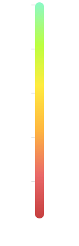
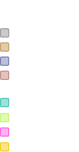

<link rel="stylesheet" href="css/styles.css">

```js
const co2 = FileAttachment("data/CO2_monthly_mean_data.csv").csv()
const anom = FileAttachment("data/GlobalAvgTempAnom.csv").csv()
```

<!-- Navbar HTML Structure -->
<div class="navbar">
    <!-- Left-side navbar content (empty for now) -->
    <div class="logo"><a href="index"></a></div>
    <div>
        <a href="extremeWeather">Extreme Weather</a>
        <a href="mainMap">Surface Temperature</a>
        <a href="ozone">Ozone Layer</a>
        <a href="stackedArea">Energy Sources</a>
        <a href="otherVisualizations">Other Visualizations</a>
        <a href="action" id="action">Take Action</a>
    </div>
</div>

<!-- -->
<!-- HERO IMAGE / SECTION -->
<!-- -->
<br>
<br>
<br>

<section class="hero">
    <div class="hero-image">
        
        <div class="hero-overlay">
            <h1>Climate Change</h1>
            <h2>Data Visualizations</h2>
        </div>
    </div>
</section>

<!-- -->
<!-- WHAT IS CLIMATE CHANGE SECTION -->
<!-- -->

<br><br>

<div class="container">
    <div class="left-column">
      <h1>What is climate change?</h1><br>
      <p>Climate change refers to long-term shifts in global temperatures and weather patterns. While some variations occur naturally due to factors like volcanic eruptions and solar cycles, human activities have significantly accelerated these changes. The primary cause is the burning of fossil fuels—such as coal, oil, and gas—which releases greenhouse gases like carbon dioxide (CO₂) and methane (CH₄) into the atmosphere. These gases trap heat, leading to rising global temperatures, a phenomenon known as global warming. Climate change affects ecosystems, sea levels, and weather patterns worldwide. 
      </p>
    </div>
    <div class="right-column">
      <h1><br></h1><br>
      <p>Rising temperatures contribute to extreme heatwaves, prolonged droughts, and intensified storms. Melting glaciers and polar ice caps lead to rising sea levels, threatening coastal communities. Additionally, shifts in precipitation patterns can disrupt agriculture, reduce freshwater availability, and increase the frequency of wildfires.
      Addressing climate change requires global efforts to reduce greenhouse gas emissions, transition to renewable energy sources, and implement sustainable practices. By taking action, we can mitigate its effects and protect the planet for future generations.</p>
    </div>
  </div>

<br><br><br><br>

<!-- -->
<!-- EXTREME WEATHER VISUALIZATION -->
<!-- -->

<h1>How does climate change affect you?</h1>
<br>
<div class="container">
    <div class="left-column">
      <!-- Visualization Code Goes Here -->
      <div id="map-container" class="map-container"></div>
      
    </div>
    <div class="right-column">
      <p>The impacts of climate change become increasingly evident each year, in more and more parts of our lives. Climate change resulting from our system of fossil-fueled production impacts the air we breath, the food we eat, and the environment we live in. <br><br>
      Rising global temperatures have led to more frequent and severe weather events, through warming oceans, faster wind speeds, and increased moisture in the atmosphere. Melting sea ice and rising sea levels have impacted communities from the Arctic to the equator. <br><br>
      With this increase in extreme weather events, more and more people have been displaced from their homes due to disasters, food insecurity, water shortages, and other climate-related disasters. The economic impacts of climate change are staggering, with damages climbing every year and the costs of insurance rising as well. The cost of living is driven up massively as a result of anthropogenic climate change, impacting every stage of our production, and having a disproportionate affect on the poorest and most vulnerable communities. <br><br>
      Despite the scale of work required to address climate change, the cost of inaction is infinitely higher.
      </p>
      <br><br>
      <a style="font-weight: bold; color: white;" href="extremeWeather">View Data →</a>
    </div>
  </div>

<!-- Load Icons for Hover -->


<!-- Load Images for Pop-up -->


```js
import { Runtime, Inspector } from "https://cdn.jsdelivr.net/npm/@observablehq/runtime@4/dist/runtime.js";

const antarctic_extent = await FileAttachment("/data/ice_extent/Antarctic-data.csv").csv();

const width = 800;
async function loadWorldMap() {
    const world = await fetch(import.meta.resolve("npm:world-atlas/land-110m.json")).then(r => r.json());
    return topojson.feature(world, world.objects.land);
}


const locations = [
    { name: "Floods", lon: 68.7356, lat: 26.3747, type: "FLOOD", brief: "2022 | Pakistan | 1/3 of the Country | 1,739 Deaths | 33 Million Affected | Damages: $40 Billion (Estimated USD)",
    info: "<hr>Heavy monsoon rains caused widespread flooding in Pakistan. Model-based analysis confirms that [the trend in cross-equatorial moisture transport] is consistent with the fingerprint of anthropogenic climate warming. <br><br> The 2022 floods in Pakistan resulted in devastating loss of life, displacement of millions, and significant damage to infrastructure and agriculture, exacerbating an already challenging humanitarian situation in the region. ", reference: "You Y. et al., (2024) Climate warming contributes to the record-shattering 2022 Pakistan rainfall, npj Climate and Atmospheric Science, doi:10.1038/s41612-024-00630-4", imgCitation: "" },
    { name: "Heat Waves", lon: -2.0000, lat: 52.0000, type: "HEAT", brief: "2022 | United Kingdom | Highest Recorded Temperature 40.3°C | 2,985 Excess Deaths in Summer of 2022",
    info: "<hr>Human-caused climate change made the event at least 10 times more likely. In observational analysis and study models, the same event would be about 2C less hot in a 1.2°C cooler world. <br><br>On July 19, the heat reached 40.3°C (104.5°F), the hottest ever recorded in the UK,  resulting in around 1,700 excess deaths, mainly among vulnerable individuals.", reference: "Zachariah, M. et al., (2022). Without human-caused climate change temperatures of 40°C in the UK would have been extremely unlikely, World Weather Attribution", imgCitation: "" },
    { name: "Tsunami", lon: -26.9650, lat: 72.8170, type: "TSUNAMI", brief: "2023 | Greenland | Global Siesmic Vibrations for Nine Days | 200m High Waves",
    info: "<hr>Greenland tsunami was triggered by a series of factors, including the melting glacial ice due to global warming. Greenland, being highly sensitive to rising temperatures, has experienced accelerated glacial retreat and destabilization in recent years, making landslides more frequent and severe. The event started a seismic vibration that was detectable around the world for over a week.", reference: "Svennevig K. et al. ,A rockslide-generated tsunami in a Greenland fjord rang Earth for 9 days. Science. 385,1196-1205(2024).DOI:10.1126/science.adm9247", imgCitation: "" },
    { name: "Drought", lon: 38.0000, lat: 8.0000, type: "DROUGHT", brief: "2017 | East Africa: Ethiopia, Kenya, Somalia, South Sudan | 40°C Recorded Temperatures | 10,000+ Deaths | 23 Million Left in Urgent Need of Food, Water, and Medical Treatment",
    info: "<hr>Anthropogenic warming of Western V sea surface temperatures contributed to East African drought. Extremely warm (FAR = 1) Western V SST doubled the probability of drought, contributing to widespread food insecurity. <br><br>The 2017 East African drought impacted millions across countries like Somalia and Ethiopia, leading to severe food insecurity and malnutrition. Estimates suggest that tens of thousands lost their lives due to famine and related health issues.", reference: "Funk, C. et al. 2018: Examining the Potential Contributions of Extreme “Western v” Sea Surface Temperatures to the 2017 March–June East African Drought. Explaining Extreme Events of 2017 from a Climate Perspective. Bull. Amer. Meteor. Soc., doi:10.1175/BAMS-D-18-0108.1", imgCitation: "" },
    { name: "Coastal Storms", lon: -80.0000, lat: 35.0000, type: "COASTAL", brief: "2024 | Catastrophic Helene Rainfall | United States | 249 Deaths",
    info: "<hr>Anthropogenic climate change causing warmer ocean and air temperatures has lead to an increase in the intensity of hurricanes. Sea level rise has also made coastal storms more damaging, in the last century, sea levels have already rose more than half a foot, a trend expected to more than double to between 1 and 2.5 feet in the current century.<br><br>In a 1.5°C warming world, these events are more common, more severe, and more deadly. Hurricane Helene was the deadliest hurricane in the contiguous United States since Katrina (2005).", reference: "Clarke, B. et al., (2024). Climate change key driver of catastrophic impacts of Hurricane Helene that devastated both coastal and inland communities. spiral.imperial.ac.uk. https://doi.org/10.25561/115024", imgCitation: "" },
    { name: "Rising Sea Levels", lon: -52.5055, lat: -32.0260, type: "RISINGSEA", brief: "2024 | Rio Grande do Sul, Brazil | 181 Deaths | 2.4 Million Affected | Damages: $3.7 Billion (Estimated USD)",
    info: "<hr>In 2024, the state of Rio Grande do Sul in Brazil saw massive flooding caused by heavy rain and storms. These floods have bee exacerbated by climate change and El Niño, alongside the rising water levels that have lead to even more displacement and destruction. <br><br>According to the 2023 IPCC report, relative sea levels in the South Atlantic have increased at a higher rate than the global mean. This trend is extremely likely to continue, contributing to increased coastal flooding and shoreline retreat.", reference: "IPCC, (2023). Regional fact sheet -- Central and South America. Sixth Assessment Report. https://www.ipcc.ch/report/ar6/wg1/downloads/factsheets/IPCC_AR6_WGI_Regional_Fact_Sheet_Central_and_South_America.pdf", imgCitation: "" },
    { name: "Precipitation", lon: 10.0000, lat: 48.0000, type: "PRECIP", brief: "2021 | Western Europe | 300mm in 24 Hours | 243 Deaths | Damages: $35 Billion (Estimated USD)", info: "<hr>Extreme rainfall over the period of 1-2 days lead to massive flooding. The historic amount of rain broke records by wide margins, creating conditions no area was prepared for, leading to massive devestation. <br><br>The amounts of rainfall observed in Western Europe in 2021 would have once been considered a once-in-a-millennium event, but climate scientists have suggested the frequency of such events is increasing, and will likely become more frequent in the future.", reference: "Kreienkamp, F. et al., (2021). Rapid attribution of heavy rainfall events in Western Europe July 2021. World Weather Attribution. https://www.worldweatherattribution.org/wp-content/uploads/Scientific-report-Western-Europe-floods-2021-attribution.pdf", imgCitation: ""},
    { name: "Forest Fires", lon: 133.2711, lat: -22.7390, type: "FF", brief: "2020 | Australian Bushfires | 19 Million Hectares Burnt | 715 Million Tonnes of CO₂ Emitted | 3 Billion Animals Killed or Displaced",
    info: "<hr>In 2019 and 2020, the 'Black Summer' brushfires ravaged Australia, making global news. During the fires, more than three billion animals were killed or displaced. These extreme wildfire events are more common and expected to increase by 50% as a result of anthropogenic climate change through extreme heat, dryness, and faster wind speeds. <br><br>Emissions from wildfires contributed 4.8% to total global emissions in 2021, a total of 1.76 billion tonnes", reference: "Hortle, R. (2025, February 25). In a dangerously warming world, we must confront the grim reality of Australia’s bushfire emissions. University of Tasmania. https://www.utas.edu.au/about/news-and-stories/articles/2024/ <br>Mallapaty, S. (2021). Australian bush fires beleched out immense quantity of carbon. Nature 597, 459-460", imgCitation: "" },
    { name: "Typhoon", lon: 124.5228, lat: 8.4268, type: "TYPHOON", brief: "2024 | 6 Typhoons in 1 Month | Philippines | 13 Million People Impacted | 163 Deaths | Damages: $500 million (Estimated USD)",
    info: "<hr>In the space of one month between October and November, six typhoons hit the Philippines. Thirteen million people were impacted, with consecutive (and sometimes simultaneous) storms devestating the Northern islands of the Philippines. <br><br>Climate change has made conditions for the formation and intensification of typhoons nearly twice as likely, and we have seen an increase in the occurance of extreme typhoons (tropical cyclones in Northwestern Pacific) and hurricanes (Atlantic or Northeastern Pacific)", reference: "Merz, N. et al. (2024) Climate change supercharged late typhoooon season in the Philippines, highlighting the need for resilience to consecutive events. https://www.dx.doi.org/10.25561/116202", imgCitation: "" },
    { name: "Antarctica", lon: 0.0000, lat: -80.2917, type: "ICEMELT", brief: "2023 | Ice Melt | Antarctica | 16in (40.6cm) Predicted Sea Level Rise by 2100 | 150 Billion Tonnes of Ice Lost per Year",
    info: "<hr>Antarctic sea ice extent hit a record low in 2023, and the trend of Antarctic ice has continued at a rate of 150 Billion Tonnes of ice. Like the Arctic, Antarctic sea ice acts as a global air conditioning system through the reflecting sunlight and cooling polar vortexes) <br><br>This feedback loop is actively contributing to increasing global warming, and in the arctic, leading to warming at a rate twice the global average.", reference: "IPCC, (2023). Regional fact sheet -- Polar Regions. Sixth Assessment Report. https://www.ipcc.ch/report/ar6/wg1/downloads/factsheets/IPCC_AR6_WGI_Regional_Fact_Sheet_Polar_regions.pdf", imgCitation: "" }
];


function showPopup(event, location) {
    d3.select("#popup").remove();

    const imgElement = document.querySelector(`img[alt='${location.type} Pic']`);
    const imgSrc = imgElement ? imgElement.src : "imgs/icons/EMPTY.svg"; 

    const popup = d3.select("body").append("div")
        .attr("id", "popup")
        .style("position", "fixed")
        .style("left", "50%")
        .style("top", "35%")
        .style("transform", "translate(-50%, -50%)")
        .style("background-color", "rgba(0, 0, 0, 0.8)")
        .style("padding", "20px")
        .style("border", "1px solid white")
        .style("z-index", "1000")
        .style("border-radius", "10px")
        .style("width", "80%")
        .style("max-width", "1000px")
        .style("height", "auto")
        .style("max-height", "90%")
        .style("overflow-y", "auto")
        .style("box-shadow", "2px 2px 10px rgba(255,255,255,0.3)")
        .style("text-align", "left")
        .style("display", "flex")
        .style("flex-direction", "column");

    // Add a close button
    popup.append("div")
        .style("text-align", "right")
        .html(`<button id="close-popup" style="border:none; background:none; cursor:pointer; font-size: 18px; color: white;">X</button>`);

    // Add a container for the image and text
    const contentContainer = popup.append("div")
        .style("display", "flex")
        .style("align-items", "flex-start");

    // Add the background image as a separate div
    contentContainer.append("div")
        .style("flex-shrink", "0")
        .style("width", "20vw")
        .style("max-width", "150px")
        .style("height", "30vh")
        .style("background", `url(${imgSrc}) center/cover no-repeat`)
        .style("margin-right", "20px")
        .style("border-radius", "5px");

    // Add location details
    contentContainer.append("div")
        .style("color", "white")
        .html(`
            <h2>${location.name}</h2>
            <h4>${location.brief}<h4>
            <p>${location.info || "No additional information available."}</p>
        `);

    // Add image citation if available
    if (location.imgCitation) {
        popup.append("div")
            .style("font-size", "12px")
            .style("color", "#ccc")
            .style("margin-top", "5px")
            .html(`<em>${location.imgCitation}</em>`);
    }

    // Add reference section
    popup.append("div")
        .style("font-size", "12px")
        .style("color", "#ccc")
        .style("border-top", "1px solid #ddd")
        .style("padding-top", "10px")
        .html(`<em>Reference: ${location.reference || "No reference provided."}</em>`);

    // Close button functionality
    d3.select("#close-popup").on("click", () => popup.remove());
}


// Function to show a tooltip on hover
function showTooltip(event, location) {
    d3.select("#tooltip").remove(); // Remove existing tooltip to prevent duplicates

    // Dynamically get the src of the image based on the location type
    const imgElement = document.querySelector(`img[alt='${location.type} Icon']`);
    const imgSrc = imgElement ? imgElement.src : "imgs/icons/EMPTY.svg"; // Fallback to EMPTY.svg if no match is found

    const tooltip = d3.select("body").append("div")
        .attr("id", "tooltip")
        .style("position", "absolute")
        .style("left", `${event.pageX - 90}px`)
        .style("top", `${event.pageY - 150}px`)
        .style("width", "180px")
        .style("height", "180px")
        .style("pointer-events", "none")
        .style("z-index", "1000")
        .style("background", `url(${imgSrc}) center/contain no-repeat`)
        .style("display", "flex")
        .style("align-items", "center")
        .style("justify-content", "center")
        .style("color", "white")
        .style("font-size", "14px")
        .style("font-weight", "bold")

    // Add text on top of the image
    tooltip.append("div")
        .style("text-align", "right")
        .style("padding", "5px")
        .style("border-radius", "5px")
        .style("color", "white")
}


function hideTooltip() {
    d3.select("#tooltip").remove();
}

/* Render Map */
async function renderMap() {
    const mapContainer = document.getElementById("map-container");
    mapContainer.innerHTML = "";

    const world = await loadWorldMap();

    const colorScale = {
        FLOOD: "#925CFF",
        HEAT: "#EB8D00",
        DROUGHT: "#FFEE00",
        ICEMELT: "#FAFAFA",
        TYPHOON: "#A1A2A5",
        RISINGSEA: "#AA8FFF",
        FF: "#FF4647",
        TSUNAMI: "#93C83C",
        PRECIP: "#6BA5FF",
        COASTAL: "#34D8CC"
    };

    const newMap = Plot.plot({
        width,
        projection: "equal-earth",
        marks: [
            Plot.graticule({ stroke: "grey" }),
            Plot.sphere({ stroke: "grey" }),
            Plot.geo(world, { fill: "grey", stroke: "grey" }),
            Plot.dot(locations, {
                x: "lon",
                y: "lat",
                r: 10,
                fill: d => colorScale[d.type] || "grey",
                fillOpacity: 0.7,
                stroke: "white"
            })
        ]
    });

    // Add the new map to the container
    mapContainer.appendChild(newMap);

    // Select the actual rendered dots inside the SVG
    d3.select(mapContainer).selectAll("svg circle")
        .style("cursor", "pointer")
        .on("click", function (event, d) {
            const index = d3.select(this).datum();
            if (index !== undefined) {
                showPopup(event, locations[index]);
            }
        })
        .on("mouseover", function (event, d) {
            const index = d3.select(this).datum();
            if (index !== undefined) {
                showTooltip(event, locations[index]);
            }
        })
        .on("mousemove", function (event) {
            d3.select("#tooltip")
                .style("left", `${event.pageX - 30}px`)
                .style("top", `${event.pageY - 150}px`);
        })
        .on("mouseout", hideTooltip);
}

renderMap();
```

<br>
<br>
<br>
<br>

<!-- -->
<!-- GLOBAL WARMING VISUALIZATION / MAIN MAP -->
<!-- -->

<h1>What impacts has climate change had on our planet?</h1>
<br>
<div class="container">
    <div class="left-column">
        <p>Human activities have released <em>greenhouse gases</em>, like Carbon Dioxide and Methane, that trap sunlight in the atmosphere and reflect it back onto the Earth. The natural greenhouse effect keeps the Earth habitable for human life, but the massive increase in atmospheric Carbon Dioxide from our burning of fossil fuels has super-charged this effect and led to warming nearing 1.5°C above pre-industrial levels. 2024 was the first year on record to exceed 1.5°C, and the last 10 years have all been the hottest on record. This change is measured in global temperature anomalies compared to the 20th century average (1901-2000). While the world hasn't officially passed 1.5 degrees warming, as the official measurements are over decade averages, we are quickly moving towards it. <br><br>
        Climate change has caused disruptions to ecosystems, weather patterns, and the oceans. Rising global temperatures are warming the poles faster than the equator, leading to melting ice caps, rising sea levels, and reducing the "global air conditioning" effect of the poles. These ecosystem disruptions have impacted our planet's biodiversity, making many species far more vulnerable, including plant species critical to growing food. Animal species are also being impacted, seeing massive habitat loss due to climate change and fossil fuel extraction. <br><br>
        As oceans warm, ocean biodiversity is threatened. Massive ecosystems that could hold immense biodiversity are lost through coral bleaching. Species all across the planet are being pushed to the brink of extinction, threatening ecosystems all over the world and the humans who rely on them. <br><br>
        The cumulative amount of Carbon Dioxide we have released into the atmosphere is staggering, reaching nearly 2.6 trillion tonnes of CO₂. Our system of fossil-fueled production is inextricably linked to the warming of our planet, and a change is desperately needed, most of all by those who have contributed the least to the climate crisis but are the first to suffer its consequences.
        </p>
        <br><br>
        <a style="font-weight: bold; color: white;" href="mainMap">View Data →</a>
    </div>
    <div class="right-column">
      <!-- Visualization Code Goes Here -->
        <div id="page-container">
        <div id="main-container">
            <div id="map-legend-container">
            <div id="main-map-container"></div>
            <div id="legend-container">
                
            </div>
            </div>
            <div id="co2-container-wrapper">
            <div id="slider-container"></div>
            <div id="co2-container"></div>
            </div>
        </div>
        </div>
    </div>
  </div>

```js
import { scaleLinear } from "d3-scale";
const anom = await FileAttachment("data/maps/1850-12-01T00-00-00.000000000_output.geojson").json();
const world = await fetch(import.meta.resolve("npm:world-atlas/land-110m.json")).then(r => r.json());
const annual_anom = FileAttachment("data/GlobalAvgTempAnom.csv").csv();

const cumulativeData = await FileAttachment("data/cumulativeCO2World.csv").text();
const cumulative = d3.csvParse(cumulativeData, d3.autoType);

const anomalyData = anom.features.map(d => ({
  lon: d.geometry.coordinates[0],
  lat: d.geometry.coordinates[1],
  value: d.properties.value
}));

const colourIntensity = 5;

const colorScale = scaleLinear()
  .domain([-18.2 / colourIntensity, 0, 15.2 / colourIntensity])  // Global max and min anom
  .range(["blue", "white", "red"]);


/* Render Map */
function renderMap(anomalyData) {
  const mapContainer = document.getElementById("main-map-container");
  mapContainer.innerHTML = "";

  const newMap = Plot.plot({
    width,
    // projection: {type: "orthographic", rotate: [0, -30, 20]},
    // projection: "equal-earth",
    projection: "equirectangular",
    color: {
      type: "diverging",
      domain: [-18.2, 15.2],  
      range: ["blue", "white", "red"],
      label: "Temperature Anomaly (°C)"
    },
    marks: [
      Plot.graticule({ stroke: "grey" }),
      Plot.sphere({ stroke: "grey" }),
      Plot.geo(topojson.feature(world, world.objects.land), { stroke: "grey", fill: "grey" }),
      Plot.dot(anomalyData.map(d => ({ ...d, fill: colorScale(d.value) })), {
        x: "lon",
        y: "lat",
        fill: "fill",
        fillOpacity: 0.7,
        r: width / 125,
        symbol: "square"
      })
    ]
  });


  // Add the new map to the container
  mapContainer.appendChild(newMap);
}


/* Slider */
function updateMapForIndex(index) {
  const year = 1850 + Math.floor(index / 12);
  const month = (index % 12) + 1;
  const formattedMonth = String(month).padStart(2, "0");

  const fileName = `/_file/data/maps/${year}-${formattedMonth}-01T00-00-00.000000000_output.geojson`;
  
  console.log(`Fetching GeoJSON for ${fileName}`);

  fetch(fileName)
    .then(response => {
      if (!response.ok) {
        throw new Error(`Failed to fetch ${fileName}: ${response.statusText}`);
      }
      return response.json();
    })
    .then(anom => {
      if (!anom || !anom.features) {
        throw new Error(`Invalid GeoJSON format for ${fileName}`);
      }

      console.log("Successfully loaded:", fileName);

      const anomalyData = anom.features.map(d => ({
        lon: d.geometry.coordinates[0],
        lat: d.geometry.coordinates[1],
        value: d.properties.value
      }));

      renderMap(anomalyData); // Refresh the map with new data
    })
    .catch(err => {
      console.error("Failed to load GeoJSON:", err);
    });

  window.updateCO2Line(index);
}


function createTimeSlider() {
  const sliderContainer = document.getElementById("slider-container");

  // Clear any existing content
  sliderContainer.innerHTML = "";

  // Single slider for both year and month
  const timeSlider = document.createElement("input");
  timeSlider.type = "range";
  timeSlider.id = "time-slider";
  timeSlider.min = "0";       // Jan 1850
  timeSlider.max = "2099";    // Dec 2024
  timeSlider.step = "1";
  timeSlider.value = "0";

  // Display selected date
  const dateDisplay = document.createElement("span");
  dateDisplay.id = "date-value";
  dateDisplay.style.position = "absolute";
  dateDisplay.style.transform = "translateX(-50%)";
  dateDisplay.style.bottom = "40px";
  dateDisplay.style.left = "-50%";


  function updateDateDisplay(index) {
    const year = 1850 + Math.floor(index / 12);
    const month = (index % 12) + 1;
  
    const month_names = ["January", "February", "March", "April", "May", "June", "July", "August", "September", "October", "November", "December"];
  
    dateDisplay.textContent = `${String(month_names[month - 1])} ${year}`;
  
    // Dynamically position the text above the slider thumb
    const sliderRect = timeSlider.getBoundingClientRect();
    const thumbPosition = ((index - timeSlider.min) / (timeSlider.max - timeSlider.min)) * sliderRect.width;
  
    // Clamp the position to ensure the text stays within the slider's boundaries
    const clampedPosition = Math.max(0, Math.min(thumbPosition, sliderRect.width));
  
    // Update the position of the dateDisplay element
    dateDisplay.style.left = `${clampedPosition + sliderRect.left}px`;
  }

  // Initial date display and slider color
  updateDateDisplay(timeSlider.value);

  // Event listener for slider movement
  timeSlider.addEventListener("input", (event) => {
    updateDateDisplay(event.target.value);
    updateMapForIndex(event.target.value);
  });

  // Append elements to the container
  sliderContainer.appendChild(dateDisplay);
  sliderContainer.appendChild(timeSlider);
}


/* Line Graph */
function renderCO2Lines(cumulative) {
  const parsedData = cumulative.map(d => ({
    year: +d.year, 
    cumulative_co2: +d.cumulative_co2_including_luc
  }));

  const lineContainer = document.getElementById("co2-container");
  lineContainer.innerHTML = "";

  const margin = { top: 20, right: 20, bottom: 30, left: 60 };
  const width = lineContainer.clientWidth - margin.left - margin.right;
  const height = 350 - margin.top - margin.bottom;

  const svg = d3.select(lineContainer)
    .append("svg")
    .attr("width", width + margin.left + margin.right)
    .attr("height", height + margin.top + margin.bottom)
    .append("g")
    .attr("transform", `translate(${margin.left},${margin.top})`);

  const x = d3.scaleLinear()
    .domain([d3.min(parsedData, d => d.year), d3.max(parsedData, d => d.year)])
    .range([0, width]);

  const y = d3.scaleLinear()
    .domain([0, d3.max(parsedData, d => d.cumulative_co2)])
    .range([height, 0]);

  const area = d3.area()
    .x(d => x(d.year))
    .y0(height)
    .y1(d => y(d.cumulative_co2));

  const line = d3.line()
    .x(d => x(d.year))
    .y(d => y(d.cumulative_co2));

  // Add the area
  svg.append("path")
    .datum(parsedData)
    .attr("fill", "turquoise")
    .attr("fill-opacity", 0.3)
    .attr("d", area);

  // Add the line
  svg.append("path")
    .datum(parsedData)
    .attr("fill", "none")
    .attr("stroke", "turquoise")
    .attr("stroke-width", 5)
    .attr("d", line);

  // Add horizontal gridlines
  svg.append("g")
    .attr("class", "grid")
    .call(
      d3.axisLeft(y)
        .ticks(10)
        .tickValues(y.ticks(10).filter((d, i) => i % 2 === 0))  
        .tickSize(-width)
        .tickFormat("")
    )
    .selectAll(".tick line")
    .style("stroke-opacity", 0.3);

  // Add x-axis
  svg.append("g")
    .attr("class", "x-axis")
    .attr("transform", `translate(0,0)`)
    .call(d3.axisTop(x)
      .ticks(10)
      .tickFormat(d3.format("d"))
    );

  // Add y-axis
  svg.append("g")
    .attr("class", "y-axis")
    .call(d3.axisLeft(y)
      .tickValues(y.ticks(10).filter((d, i) => i % 2 === 0))
      .ticks(10)
      .tickFormat(d => (d / 1e6).toFixed(1) + " trillion t") // Data originally in millions
    );
}

renderMap(anomalyData);
createTimeSlider();
renderCO2Lines(cumulative);
```

<!-- -->
<!-- CFC and OZONE VISUALIZATION -->
<!-- -->

<br>
<br>

```js
const ozoneData = FileAttachment("data/cfc_data.csv").csv()
```

<h1>What has been done to slow the progression of climate change?</h1>
<br>
<div class="container">
    <div class="left-column">
      <!-- Visualization Code Goes Here -->
      <div >
<div style="display: flex; align-items: center; justify-content: center; gap: 20px; width: 70%; margin-left: 15%;">
    
    
</div>

<div style="text-align: center; margin-top: 20px;">
    <label for="ozoneYearSlider">Year: <span id="yearLabel">2000</span></label><br>
    <input type="range" id="ozoneYearSlider" min="1979" max="2019" value="2000" step="1">
</div>

<div class="card">${
  Plot.plot({
    title: "CFC Levels in Northern and Southern Hemisphere",
    subtitle: "1979-2019",
    width,
    x: {
        label: "Year",
        type: "linear"
    },
    y: {
        label: "CFC Concentration (ppt)",
        type: "linear",
        domain: [0, 600] // Adjust based on min/max values in the dataset
    },
    marks: [
        Plot.ruleY([0]),
        // CFC 11 Northern Hemisphere (Light Blue)
        Plot.dot(ozoneData, {
          x: "YEAR",
          y: "CFC11_NH",
          stroke: "#4a90e2",
          fill: "#4a90e2",
          tip: true,
        }),
        // CFC 11 Southern Hemisphere (Light Red/Coral)
        Plot.dot(ozoneData, {
          x: "YEAR",
          y: "CFC11_SH",
          stroke: "#9b59b6",
          fill: "#9b59b6",
          tip: true,
        }),
        // CFC 12 Northern Hemisphere (Light Blue)
        Plot.dot(ozoneData, {
          x: "YEAR",
          y: "CFC12_NH",
          stroke: "#50b8482",
          fill: "#50b848",
          tip: true,
        }),
        // CFC 12 Southern Hemisphere (Light Red/Coral)
        Plot.dot(ozoneData, {
          x: "YEAR",
          y: "CFC12_SH",
          stroke: "#ffcc00",
          fill: "#ffcc00",
          tip: true,
        }),
        // CFC 113 Northern Hemisphere (Light Blue)
        Plot.dot(ozoneData, {
          x: "YEAR",
          y: "CFC113_NH",
          stroke: "#f07a59",
          fill: "#f07a59",
          tip: true,
        }),
        // CFC 113 Southern Hemisphere (Light Red/Coral)
        Plot.dot(ozoneData, {
          x: "YEAR",
          y: "CFC113_SH",
          stroke: " #f62626",
          fill: "#f62626",
          tip: true,
        }),
    ]
})
}</div>

<div style="display: flex; flex-wrap: wrap; gap: 10px; align-items: center;">
  <div style="width: 15px; height: 15px; background-color: #4a90e2;"></div> CFC-11 NH
  <div style="width: 15px; height: 15px; background-color: #9b59b6;"></div> CFC-11 SH
  <div style="width: 15px; height: 15px; background-color: #50b848;"></div> CFC-12 NH
  <div style="width: 15px; height: 15px; background-color: #ffcc00;"></div> CFC-12 SH
  <div style="width: 15px; height: 15px; background-color:#f07a59;"></div> CFC-113 NH
  <div style="width: 15px; height: 15px; background-color:#f62626;"></div> CFC-113 SH
</div>
</div>
    </div>
    <div class="right-column">
      <p>
        In response to the growing threat of climate change, global efforts have been made to reduce greenhouse gas emissions and promote sustainability. One of the most significant achievements is the Paris Agreement, an international treaty adopted in 2015, in which nearly 200 countries committed to limiting global temperature rise to well below 2°C above pre-industrial levels. This agreement has led nations to set ambitious targets for reducing carbon emissions and transitioning to cleaner energy sources.<br><br>
        Governments around the world have implemented policies to cut reliance on fossil fuels and encourage the use of renewable energy. Wind, solar, and hydroelectric power have been expanding rapidly, providing cleaner alternatives to coal and oil. Many countries have also introduced carbon pricing mechanisms, such as carbon taxes and cap-and-trade systems, to incentivize businesses to lower their emissions. Additionally, regulations on vehicle emissions and investments in electric vehicle infrastructure have aimed to reduce pollution from the transportation sector.<br><br>
        Reforestation and conservation initiatives have played a crucial role in absorbing carbon dioxide from the atmosphere. Large-scale tree-planting programs, such as the Great Green Wall project in Africa and reforestation efforts in the Amazon, aim to restore ecosystems and improve carbon sequestration. Efforts to protect and restore wetlands, peatlands, and mangroves have also contributed to climate mitigation by preserving natural carbon sinks.<br><br>
        Advancements in technology have led to more energy-efficient solutions across industries. Innovations in sustainable agriculture, such as precision farming and regenerative practices, have helped reduce carbon footprints while maintaining food production. Additionally, businesses and cities have been investing in green buildings, smart grids, and waste reduction strategies to cut emissions and improve sustainability.<br><br>
        Public awareness and activism have also played a vital role in pushing for stronger climate policies. Organizations, scientists, and environmental advocates continue to educate people on the importance of reducing carbon footprints. As a result, individuals and corporations have taken steps toward sustainability by adopting renewable energy, reducing waste, and supporting climate-friendly initiatives.
      </p>
      <br><br>
      <a style="font-weight: bold; color: white;" href="ozone">View Data →</a>
    </div>
  </div>

<script>
    document.getElementById("ozoneYearSlider").addEventListener("input", function() {
        const year = this.value;
        document.getElementById("yearLabel").innerText = year;

        const imageUrl = `https://raw.githubusercontent.com/proctor18/renewable-energy-data/main/ozone_images/${year}.png`;

        document.getElementById("ozoneImage").src = imageUrl;
    });
</script>

<!-- -->
<!-- STACKED AREA RENEWABLE ENERGY VISUALIZATION -->
<!-- -->

<br><br>

<h1>What else can be done to slow climate change?</h1>
<div class="container">
    <div class="left-column">
        <p>
          Combatting climate change will require change from individuals, but especially from corporations and governments. Those in positions of power must take the crucial steps towards accelerating a transition to renewable energy. <br><br>
          This green transition has the opportunity to create more durable, reliable, and clean energy systems for communities worldwide. Taken together with the more extreme weather events and natural disasters, transitioning or mode of production away from old fossil-fueled systems is necessary. <br><br>
          Alongside climate mitigation efforts, care must be taken to work with labour unions and workers to ensure that the transition to renewable energy provides good and safer jobs for workers in the fossil fuel industry. We must ensure that no one is left behind. <br><br>
          Ensuring that the transition to renewable energy sources and the fight against climate change focuses on those most impacted by climate change is crucial. For marginalized communities and those in the Global South, the die has already been cast for them; they are already facing the brunt of climate change despite being some of the least responsible for it. <br><br>
          Beyond energy production, every industry can make changes to follow more sustainable practices. In the agricultural and food industry, we can make changes to reduce food waste, eat more plant-based meals, and implement sustainable farming practices. Beyond that, the motivation to create fast fashion, fast tech, and fast supplies meant to encourage more consumption should be replaced by a focus on longevity and products that last would benefit the planet and consumers. <br><br>
          From governments, we must demand stronger climate policies, international cooperation, and politicians who will stand up for what they believe in and represent the needs of this generation and the next. <br><br>
          In the fight for what our future will look like, it can feel overwhelming and isolating to see the big picture of climate change, and feel powerless to change your future. It is always important to remember that there's always something you can do. Find out where you can make contributions with the skills and opportunities you have, and organize with others who care as much as you do. Keep pushing for a better future, and you won't be alone. <br><br>
        </p>
        <br><br>
        <a style="font-weight: bold; color: white;" href="stackedArea">View Data →</a>
    </div>
    <div class="right-column">
      <!-- Visualization Code Goes Here -->
        <div id="layout-container" style="display: flex; align-items: flex-start;">
    <div id="production-container" style="flex-grow: 1;"></div>
    <div id="button-container" style="margin-right: 20px;">
      
      <br>
      <h2>Continent</h2>
      <div id="toggle-button-container"><button class="continentButton" id="worldDataButton"></button><p>World Data</p></div>
      <div id="toggle-button-container"><button class="continentButton" id="asDataButton"></button><p>Asia</p></div>
      <div id="toggle-button-container"><button class="continentButton" id="afDataButton"></button><p>Africa</p></div>
      <div id="toggle-button-container"><button class="continentButton" id="naDataButton"></button><p>North America</p></div>
      <div id="toggle-button-container"><button class="continentButton" id="saDataButton"></button><p>South America</p></div>
      <div id="toggle-button-container"><button class="continentButton" id="euDataButton"></button><p>Europe</p></div>
      <div id="toggle-button-container"><button class="continentButton" id="ocDataButton"></button><p>Oceania</p></div>
    </div>
  </div>

  <div style="display: none;">
    <input type="checkbox" id="toggleStaticAxisButton" name="toggleAxis"/>
    <label for="toggleStaticAxisButton">Toggle Static Axis</label>
  </div>

  <div id="data-table-container" style="display: none;">
    <table id="data-table">
      <thead>
        <tr>
          <th>Source</th>
          <th>Production (TWh)</th>
        </tr>
      </thead>
      <tbody></tbody>
    </table>
  </div>
    </div>
  </div>


```js
const worldData = await FileAttachment("data/electricity-prod-source-stacked.csv").text();
const afData = await FileAttachment("data/shareElecBySourceAF.csv").text();
const asData = await FileAttachment("data/shareElecBySourceAS.csv").text();
const euData = await FileAttachment("data/shareElecBySourceEU.csv").text();
const naData = await FileAttachment("data/shareElecBySourceNA.csv").text();
const saData = await FileAttachment("data/shareElecBySourceSA.csv").text();
const ocData = await FileAttachment("data/shareElecBySourceOC.csv").text();

const totalElec = d3.csvParse(worldData, d3.autoType);
const afElec = d3.csvParse(afData, d3.autoType);
const asElec = d3.csvParse(asData, d3.autoType);
const euElec = d3.csvParse(euData, d3.autoType);
const naElec = d3.csvParse(naData, d3.autoType);
const saElec = d3.csvParse(saData, d3.autoType);
const ocElec = d3.csvParse(ocData, d3.autoType);

const keyMapping = {
  "Electricity from coal - TWh (adapted for visualization of chart electricity-prod-source-stacked)": "Coal",
  "Electricity from gas - TWh (adapted for visualization of chart electricity-prod-source-stacked)": "Gas",
  "Electricity from hydro - TWh (adapted for visualization of chart electricity-prod-source-stacked)": "Hydro",
  "Electricity from solar - TWh (adapted for visualization of chart electricity-prod-source-stacked)": "Solar",
  "Electricity from wind - TWh (adapted for visualization of chart electricity-prod-source-stacked)": "Wind",
  "Electricity from oil - TWh (adapted for visualization of chart electricity-prod-source-stacked)": "Oil",
  "Electricity from nuclear - TWh (adapted for visualization of chart electricity-prod-source-stacked)": "Nuclear",
  "Other renewables excluding bioenergy - TWh (adapted for visualization of chart electricity-prod-source-stacked)": "Other Renewables",
  "Electricity from bioenergy - TWh (adapted for visualization of chart electricity-prod-source-stacked)": "Bioenergy"
};

const continentKeyMapping = {
  "Other.renewables.excluding.bioenergy...TWh..adapted.for.visualization.of.chart.electricity.prod.source.stacked.": "Other Renewables",
  "Electricity.from.bioenergy...TWh..adapted.for.visualization.of.chart.electricity.prod.source.stacked.": "Bioenergy",
  "Electricity.from.solar...TWh..adapted.for.visualization.of.chart.electricity.prod.source.stacked.": "Solar",
  "Electricity.from.wind...TWh..adapted.for.visualization.of.chart.electricity.prod.source.stacked.": "Wind",
  "Electricity.from.hydro...TWh..adapted.for.visualization.of.chart.electricity.prod.source.stacked.": "Hydro",
  "Electricity.from.nuclear...TWh..adapted.for.visualization.of.chart.electricity.prod.source.stacked.": "Nuclear",
  "Electricity.from.oil...TWh..adapted.for.visualization.of.chart.electricity.prod.source.stacked.": "Oil",
  "Electricity.from.gas...TWh..adapted.for.visualization.of.chart.electricity.prod.source.stacked.": "Gas",
  "Electricity.from.coal...TWh..adapted.for.visualization.of.chart.electricity.prod.source.stacked.": "Coal"
};

  
const colorMapping = {
  "Other Renewables": "#fff",
  "Bioenergy": "#C4F86F",
  "Solar": "#F7CD1B",
  "Wind": "#FF63E3",
  "Hydro": "#46C6B8",
  "Nuclear": "#C69D63",
  "Oil": "#9E9D9D",
  "Gas": "#C68982",
  "Coal": "#7280B2"
};

function renderTotalAreaPlot(elec) {
  const areaContainer = document.getElementById("production-container");
  
  // Clear the container to avoid overlapping elements
  areaContainer.innerHTML = "";

  // Dynamically calculate dimensions
  const margin = { top: 20, right: 30, bottom: 30, left: 60 };
  const width = areaContainer.clientWidth - margin.left - margin.right;
  const height = 600 - margin.top - margin.bottom;

  const svg = d3.select(areaContainer)
    .append("svg")
    .attr("width", width + margin.left + margin.right)
    .attr("height", height + margin.top + margin.bottom)
    .append("g")
    .attr("transform", `translate(${margin.left},${margin.top})`);

  const x = d3.scaleTime()
    .domain(staticAxis && globalXDomain ? globalXDomain : [
      d3.min(elec, d => new Date(d.Year, 0, 1)),
      d3.max(elec, d => new Date(d.Year, 11, 31))
    ])
    .range([0, width]);

  const y = d3.scaleLinear()
    .domain(staticAxis && globalYDomain ? globalYDomain : [
      0,
      d3.max(elec, d => d3.sum(Object.values(d).slice(1)))
    ])
    .range([height, 0]);

  const color = d => colorMapping[keyMapping[d]] || "#000000";

  const stack = d3.stack()
    .keys(Object.keys(keyMapping))
    .order(d3.stackOrderNone)
    .offset(d3.stackOffsetNone);

  const area = d3.area()
    .x(d => x(new Date(d.data.Year, 0, 1)))
    .y0(d => y(d[0]))
    .y1(d => y(d[1]));

  const layers = stack(elec);

  svg.selectAll(".layer")
    .data(layers)
    .enter().append("path")
    .attr("class", "layer")
    .attr("d", area)
    .style("fill", d => color(d.key))
    .style("stroke", d => color(d.key))
    .style("stroke-width", 2)
    .style("fill-opacity", 0.5)
    .on("mouseover", function(event, d) {
      d3.select(this).style("fill-opacity", 0.9);
      const year = Math.min(Math.max(Math.round(x.invert(d3.pointer(event, this)[0]).getFullYear()), d3.min(elec, d => d.Year)), d3.max(elec, d => d.Year));
      showTooltip(event, d, year);
      updateHoverLine(year);
    })
    .on("mousemove", function(event, d) {
      const year = Math.min(Math.max(Math.round(x.invert(d3.pointer(event, this)[0]).getFullYear()), d3.min(elec, d => d.Year)), d3.max(elec, d => d.Year));
      moveTooltip(event, d, year);
      updateHoverLine(year);
    })
    .on("mouseout", function(event, d) {
      d3.select(this).style("fill-opacity", 0.5);
      hideTooltip();
      hideHoverLine();
    })
    .on("click", function(event, d) {
      const year = Math.min(Math.max(Math.round(x.invert(d3.pointer(event, this)[0]).getFullYear()), d3.min(elec, d => d.Year)), d3.max(elec, d => d.Year));
      updateTable(year);
      updateClickLine(year);
    });

  // Add x-axis
  svg.append("g")
    .attr("class", "x-axis")
    .attr("transform", `translate(0,${height})`)
    .call(d3.axisBottom(x).ticks(d3.timeYear.every(10)).tickFormat(d3.timeFormat("%Y")));
  
  // Add x-axis label
  svg.append("text")
    .attr("class", "x-axis-label")
    .attr("text-anchor", "middle")
    .attr("x", width / 2)
    .attr("y", height + margin.bottom - 5)
    .style("font-size", "16px")
    .style("font-weight", "bold")
    .style("fill", "white")
    .text("Year");
  
  // Add y-axis
  svg.append("g")
    .attr("class", "y-axis")
    .call(d3.axisLeft(y).ticks(10).tickFormat(d3.format(".2s")));
  
  // Add y-axis label
  svg.append("text")
    .attr("class", "y-axis-label")
    .attr("text-anchor", "middle")
    .attr("transform", `rotate(-90)`)
    .attr("x", -height / 2)
    .attr("y", -margin.left + 15)
    .style("font-size", "16px")
    .style("font-weight", "bold")
    .style("fill", "white")
    .text("Electricity Production (TWh)"); // Replace with your desired label text

  // Add hover line
  const hoverLine = svg.append("line")
    .attr("class", "hover-line")
    .attr("y1", 0)
    .attr("y2", height)
    .attr("stroke", "gray")
    .attr("stroke-width", 1)
    .attr("stroke-dasharray", "4 4")
    .style("display", "none");

  // Add click line
  const clickLine = svg.append("line")
    .attr("class", "click-line")
    .attr("y1", 0)
    .attr("y2", height)
    .attr("stroke", "grey")
    .attr("stroke-width", 3)
    .style("display", "none");

  // Tooltip functions
  function showTooltip(event, d, year) {
    const tooltip = d3.select("#tooltip");
    const layerData = d.find(layer => layer.data.Year === year);
    const value = layerData ? layerData[1] - layerData[0] : 0;
    const source = keyMapping[d.key] || d.key;
    tooltip
      .style("display", "block")
      .style("background-color", "black")
      .style("border", "1px solid white")
      .style("border-width", "2px")
      .style("border-radius", "5px")
      .style("color", color(d.key))
      .style("text-align", "center")
      .style("padding", "5px")
      .style("position", "absolute")
      .style("font-size", "16px")
      .html(`${year}<br>${source}<br>${value.toFixed(2)} TWh`);
  }

  function moveTooltip(event, d, year) {
    const tooltip = d3.select("#tooltip");
    tooltip
      .style("left", `${event.pageX - 50}px`)
      .style("top", `${event.pageY - 100}px`);
  }

  function hideTooltip() {
    const tooltip = d3.select("#tooltip");
    tooltip.style("display", "none");
  }

  // Update hover line function
  function updateHoverLine(year) {
    hoverLine.attr("x1", x(new Date(year, 0, 1)))
      .attr("x2", x(new Date(year, 0, 1)))
      .style("display", "block");
  }

  function hideHoverLine() {
    hoverLine.style("display", "none");
  }

  // Update click line function
  function updateClickLine(year) {
    clickLine.attr("x1", x(new Date(year, 0, 1)))
      .attr("x2", x(new Date(year, 0, 1)))
      .style("display", "block");
  }

  // Update table function
  function updateTable(year) {
    const tableBody = d3.select("#data-table tbody");
    tableBody.html("");
    
    const filteredData = elec.filter(d => d.Year === year);
    filteredData.forEach(d => {
      Object.keys(d).forEach(key => {
        if (key !== "Year" && key !== "Entity" && key !== "Code") {
          tableBody.append("tr")
            .html(`<td>${keyMapping[key] || key}</td><td>${d[key]}</td>`);
        }
      });
    });
  }
}

// Add a resize event listener
window.addEventListener("resize", () => renderTotalAreaPlot(totalElec));


function renderContinentAreaPlot(elec) {
  const areaContainer = document.getElementById("production-container");
  areaContainer.innerHTML = "";
  
  // Clear the container to avoid overlapping elements
  areaContainer.innerHTML = "";

  // Dynamically calculate dimensions
  const margin = { top: 20, right: 30, bottom: 30, left: 60 };
  const width = areaContainer.clientWidth - margin.left - margin.right;
  const height = 600 - margin.top - margin.bottom;

  const svg = d3.select(areaContainer)
    .append("svg")
    .attr("width", width + margin.left + margin.right)
    .attr("height", height + margin.top + margin.bottom)
    .append("g")
    .attr("transform", `translate(${margin.left},${margin.top})`);

  const x = d3.scaleTime()
    .domain(staticAxis && globalXDomain ? globalXDomain : [
      d3.min(elec, d => new Date(d.Year, 0, 1)),
      d3.max(elec, d => new Date(d.Year, 11, 31))
    ])
    .range([0, width]);

  const y = d3.scaleLinear()
    .domain(staticAxis && globalYDomain ? globalYDomain : [
      0,
      d3.max(elec, d => d3.sum(Object.values(d).slice(4))) // Adjusted for continent data
    ])
    .range([height, 0]);
  
  const color = d => colorMapping[continentKeyMapping[d]] || "#000000";

  const keys = Object.keys(continentKeyMapping);

  const stack = d3.stack()
    .keys(keys)
    .order(series => d3.range(series.length).reverse())
    .offset(d3.stackOffsetNone);

  const area = d3.area()
    .x(d => x(new Date(d.data.Year, 0, 1)))
    .y0(d => y(d[0]))
    .y1(d => y(d[1]));

  const layers = stack(elec);

  // Add the layers
  svg.selectAll(".layer")
    .data(layers)
    .enter().append("path")
    .attr("class", "layer")
    .attr("d", area)
    .style("fill", d => color(d.key))
    .style("stroke", d => color(d.key))
    .style("stroke-width", 2)
    .style("fill-opacity", 0.5)
    .on("mouseover", function(event, d) {
      d3.select(this).style("fill-opacity", 0.9);
      const year = Math.min(Math.max(Math.round(x.invert(d3.pointer(event, this)[0]).getFullYear()), d3.min(elec, d => d.Year)), d3.max(elec, d => d.Year));
      showTooltip(event, d, year);
      updateHoverLine(year);
    })
    .on("mousemove", function(event, d) {
      const year = Math.min(Math.max(Math.round(x.invert(d3.pointer(event, this)[0]).getFullYear()), d3.min(elec, d => d.Year)), d3.max(elec, d => d.Year));
      moveTooltip(event, d, year);
      updateHoverLine(year);
    })
    .on("mouseout", function(event, d) {
      d3.select(this).style("fill-opacity", 0.5);
      hideTooltip();
      hideHoverLine();
    })
    .on("click", function(event, d) {
      const year = Math.min(Math.max(Math.round(x.invert(d3.pointer(event, this)[0]).getFullYear()), d3.min(elec, d => d.Year)), d3.max(elec, d => d.Year));
      updateTable(year);
      updateClickLine(year);
    });

  // Add x-axis
  svg.append("g")
    .attr("class", "x-axis")
    .attr("transform", `translate(0,${height})`)
    .call(d3.axisBottom(x).ticks(d3.timeYear.every(10)).tickFormat(d3.timeFormat("%Y")));
  
  // Add x-axis label
  svg.append("text")
    .attr("class", "x-axis-label")
    .attr("text-anchor", "middle")
    .attr("x", width / 2)
    .attr("y", height + margin.bottom - 5)
    .style("font-size", "16px")
    .style("font-weight", "bold")
    .style("fill", "white")
    .text("Year");
  
  // Add y-axis
  svg.append("g")
    .attr("class", "y-axis")
    .call(d3.axisLeft(y).ticks(10).tickFormat(d3.format(".2s")));
  
  // Add y-axis label
  svg.append("text")
    .attr("class", "y-axis-label")
    .attr("text-anchor", "middle")
    .attr("transform", `rotate(-90)`)
    .attr("x", -height / 2)
    .attr("y", -margin.left + 15)
    .style("font-size", "16px")
    .style("font-weight", "bold")
    .style("fill", "white")
    .text("Electricity Production (TWh)"); // Replace with your desired label text

  // Add hover line
  const hoverLine = svg.append("line")
    .attr("class", "hover-line")
    .attr("y1", 0)
    .attr("y2", height)
    .attr("stroke", "gray")
    .attr("stroke-width", 1)
    .attr("stroke-dasharray", "4 4")
    .style("display", "none");

  // Add click line
  const clickLine = svg.append("line")
    .attr("class", "click-line")
    .attr("y1", 0)
    .attr("y2", height)
    .attr("stroke", "grey")
    .attr("stroke-width", 3)
    .style("display", "none");

  // Tooltip functions
  function showTooltip(event, d, year) {
    const tooltip = d3.select("#tooltip");
    const layerData = d.find(layer => layer.data.Year === year);
    const value = layerData ? layerData[1] - layerData[0] : 0;
    const source = continentKeyMapping[d.key] || d.key; // Use shorthand names
    tooltip
      .style("display", "block")
      .style("background-color", "black")
      .style("border", "1px solid white")
      .style("border-width", "2px")
      .style("border-radius", "5px")
      .style("color", color(d.key))
      .style("text-align", "center")
      .style("padding", "5px")
      .style("font-size", "16px")
      .html(`${year}<br>${source}<br>${value.toFixed(2)} TWh`);
  }

  function moveTooltip(event, d, year) {
    const tooltip = d3.select("#tooltip");
    tooltip
      .style("left", `${event.pageX - 50}px`)
      .style("top", `${event.pageY - 100}px`);
  }

  function hideTooltip() {
    const tooltip = d3.select("#tooltip");
    tooltip.style("display", "none");
  }

  // Update hover line function
  function updateHoverLine(year) {
    hoverLine.attr("x1", x(new Date(year, 0, 1)))
      .attr("x2", x(new Date(year, 0, 1)))
      .style("display", "block");
  }

  function hideHoverLine() {
    hoverLine.style("display", "none");
  }

  // Update click line function
  function updateClickLine(year) {
    clickLine.attr("x1", x(new Date(year, 0, 1)))
      .attr("x2", x(new Date(year, 0, 1)))
      .style("display", "block");
  }

  // Update table function
  function updateTable(year) {
    const tableBody = d3.select("#data-table tbody");
    tableBody.html(""); // Clear existing content

    const filteredData = elec.filter(d => d.Year === year);
    filteredData.forEach(d => {
      keys.forEach(key => {
        tableBody.append("tr")
          .html(`<td>${continentKeyMapping[key] || key}</td><td>${d[key]}</td>`); // Use shorthand names
      });
    });
  }
}

// Global variable to track the currently active dataset
let currentDataset = "world"; // Default to "world"

// Add event listeners to buttons
document.getElementById("worldDataButton").addEventListener("click", () => {
  currentDataset = "world"; // Update the active dataset
  renderTotalAreaPlot(totalElec);
});
document.getElementById("afDataButton").addEventListener("click", () => {
  currentDataset = "africa"; // Update the active dataset
  renderContinentAreaPlot(afElec);
});
document.getElementById("asDataButton").addEventListener("click", () => {
  currentDataset = "asia"; // Update the active dataset
  renderContinentAreaPlot(asElec);
});
document.getElementById("euDataButton").addEventListener("click", () => {
  currentDataset = "europe"; // Update the active dataset
  renderContinentAreaPlot(euElec);
});
document.getElementById("naDataButton").addEventListener("click", () => {
  currentDataset = "northAmerica"; // Update the active dataset
  renderContinentAreaPlot(naElec);
});
document.getElementById("ocDataButton").addEventListener("click", () => {
  currentDataset = "oceania"; // Update the active dataset
  renderContinentAreaPlot(ocElec);
});
document.getElementById("saDataButton").addEventListener("click", () => {
  currentDataset = "southAmerica"; // Update the active dataset
  renderContinentAreaPlot(saElec);
});

// Update the resize event listener
window.addEventListener("resize", () => {
  switch (currentDataset) {
    case "world":
      renderTotalAreaPlot(totalElec);
      break;
    case "africa":
      renderContinentAreaPlot(afElec);
      break;
    case "asia":
      renderContinentAreaPlot(asElec);
      break;
    case "europe":
      renderContinentAreaPlot(euElec);
      break;
    case "northAmerica":
      renderContinentAreaPlot(naElec);
      break;
    case "oceania":
      renderContinentAreaPlot(ocElec);
      break;
    case "southAmerica":
      renderContinentAreaPlot(saElec);
      break;
  }
});

// Toggle static axis
let staticAxis = false; // Global variable to track static axis state
let globalXDomain = null; // Global x-axis domain
let globalYDomain = null; // Global y-axis domain

document.getElementById("toggleStaticAxisButton").addEventListener("click", () => {
  staticAxis = !staticAxis; // Toggle the static axis state
  if (staticAxis) {
    // Set global domains based on the current data
    globalXDomain = [
      d3.min(totalElec, d => new Date(d.Year, 0, 1)),
      d3.max(totalElec, d => new Date(d.Year, 11, 31))
    ];
    globalYDomain = [
      0,
      d3.max(totalElec, d => d3.sum(Object.values(d).slice(1)))
    ];
  } else {
    globalXDomain = null;
    globalYDomain = null;
  }
});


// Create a tooltip div
d3.select("body").append("div")
  .attr("id", "tooltip")
  .style("position", "absolute")
  .style("background", "white")
  .style("border", "1px solid black")
  .style("padding", "5px")
  .style("display", "none");

renderTotalAreaPlot(totalElec);

const buttons = document.querySelectorAll(".continentButton");

buttons.forEach(button => {
  button.addEventListener("click", () => {
    // Remove "active" class from all buttons
    buttons.forEach(btn => btn.classList.remove("active"));

    // Add "active" class to the clicked button
    button.classList.add("active");

    // Call the appropriate render function based on the button's ID
    switch (button.id) {
      case "worldDataButton":
        renderTotalAreaPlot(totalElec);
        break;
      case "afDataButton":
        renderContinentAreaPlot(afElec);
        break;
      case "asDataButton":
        renderContinentAreaPlot(asElec);
        break;
      case "euDataButton":
        renderContinentAreaPlot(euElec);
        break;
      case "naDataButton":
        renderContinentAreaPlot(naElec);
        break;
      case "ocDataButton":
        renderContinentAreaPlot(ocElec);
        break;
      case "saDataButton":
        renderContinentAreaPlot(saElec);
        break;
    }
  });
});
```

<style>
/* Ensure elements use the full width and height of the viewport */
* {
    box-sizing: border-box;  /* Makes padding and borders part of the element's total width/height */
    margin: 0;
    padding: 0;
    /* outline: 1px solid red; /* Highlights all elements */
    align-items: center;
    justify-content: center;
}

/* Make sure html and body take up the full screen */
html, body {
    width: 100%;
    overflow-x: hidden; /* Prevent horizontal scrolling */
    margin: 0 auto;
    padding: 0;
}


/* Set up the main container to fill the entire screen width */
.main-container {
    width: 100vw; /* Ensures the main container takes up the full viewport width */
    max-width: 100vw;
    margin: 0;
    padding: 0;
}

.navbar {
    background-color: #1E1E1E;  /* Black background for navbar */
    color: white;             /* White text */
    padding: 10px 20px;       /* Padding for spacing */
    display: flex;
    justify-content: space-between;
    align-items: center;
    position: fixed;
    width: 100%;
    top: 0;
    z-index: 1000;
}

/* Navbar links */
.navbar a {
    color: white;            /* White text for links */
    text-decoration: none;   /* Remove underlines from links */
    margin: 0 15px;          /* Space between links */
    font-size: 18px;         /* Font size for links */
}

/* Wordmark logo */
.navbar .logo {
    font-size: 24px;         /* Larger font size for the logo */
    font-weight: bold;       /* Bold font */
}

/* Navbar on hover */
.navbar a:hover {
    text-decoration: underline;
}

/* Style for any hero section, ensuring it takes up the full screen width */
.hero {
    width: 100%;   /* Make sure the hero section doesn't exceed the viewport */
    max-width: 100%;
    padding: 0;
    margin: 0;
}

/* Prevent large elements or sections from causing overflow */
section, .section {
    width: 100%;
    max-width: 100%;
    max-height: 800px;
    margin: 0;
    padding: 0;
}

/* Ensure any images or media don't cause overflow */
img, video {
    max-width: 100%;  /* Make sure images/videos fit within their container */
    height: auto;
}


/* Additional classes for any positioned elements (optional) */
.positioned-element {
    position: relative;  /* Ensure no element is positioned off the screen */
    width: 100%;
}

</style>