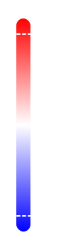

<link rel="stylesheet" href="css/styles.css">

<!-- Navbar HTML Structure -->
<div class="navbar">
    <!-- Left-side navbar content (empty for now) -->
    <div class="logo"><a href="index"></a></div>
    <div>
        <a href="extremeWeather">Extreme Weather</a>
        <a href="mainMap">Surface Temperature</a>
        <a href="ozone">Ozone Layer</a>
        <a href="stackedArea">Energy Sources</a>
        <a href="otherVisualizations">Other Visualizations</a>
        <a href="action" id="action">Take Action</a>
    </div>
</div>


```js
import { scaleLinear } from "d3-scale";
const anom = await FileAttachment("data/maps/1850-12-01T00-00-00.000000000_output.geojson").json();
const world = await fetch(import.meta.resolve("npm:world-atlas/land-110m.json")).then(r => r.json());
const annual_anom = FileAttachment("data/GlobalAvgTempAnom.csv").csv();

const cumulativeData = await FileAttachment("data/cumulativeCO2World.csv").text();
const cumulative = d3.csvParse(cumulativeData, d3.autoType);

const anomalyData = anom.features.map(d => ({
  lon: d.geometry.coordinates[0],
  lat: d.geometry.coordinates[1],
  value: d.properties.value
}));

const colourIntensity = 5;

const colorScale = scaleLinear()
  .domain([-18.2 / colourIntensity, 0, 15.2 / colourIntensity])  // Global max and min anom
  .range(["blue", "white", "red"]);


/* Render Map */
function renderMap(anomalyData) {
  const mapContainer = document.getElementById("map-container");
  mapContainer.innerHTML = "";

  const newMap = Plot.plot({
    width,
    // projection: {type: "orthographic", rotate: [0, -30, 20]},
    // projection: "equal-earth",
    projection: "equirectangular",
    color: {
      type: "diverging",
      domain: [-18.2, 15.2],  
      range: ["blue", "white", "red"],
      label: "Temperature Anomaly (°C)"
    },
    marks: [
      Plot.graticule({ stroke: "grey" }),
      Plot.sphere({ stroke: "grey" }),
      Plot.geo(topojson.feature(world, world.objects.land), { stroke: "grey", fill: "grey" }),
      Plot.dot(anomalyData.map(d => ({ ...d, fill: colorScale(d.value) })), {
        x: "lon",
        y: "lat",
        fill: "fill",
        fillOpacity: 0.7,
        r: width / 125,
        symbol: "square"
      })
    ]
  });


  // Add the new map to the container
  mapContainer.appendChild(newMap);
}


/* Slider */
function updateMapForIndex(index) {
  const year = 1850 + Math.floor(index / 12);
  const month = (index % 12) + 1;
  const formattedMonth = String(month).padStart(2, "0");

  const fileName = `/_file/data/maps/${year}-${formattedMonth}-01T00-00-00.000000000_output.geojson`;
  
  console.log(`Fetching GeoJSON for ${fileName}`);

  fetch(fileName)
    .then(response => {
      if (!response.ok) {
        throw new Error(`Failed to fetch ${fileName}: ${response.statusText}`);
      }
      return response.json();
    })
    .then(anom => {
      if (!anom || !anom.features) {
        throw new Error(`Invalid GeoJSON format for ${fileName}`);
      }

      console.log("Successfully loaded:", fileName);

      const anomalyData = anom.features.map(d => ({
        lon: d.geometry.coordinates[0],
        lat: d.geometry.coordinates[1],
        value: d.properties.value
      }));

      renderMap(anomalyData); // Refresh the map with new data
    })
    .catch(err => {
      console.error("Failed to load GeoJSON:", err);
    });

  window.updateCO2Line(index);
}


function createTimeSlider() {
  const sliderContainer = document.getElementById("slider-container");

  // Clear any existing content
  sliderContainer.innerHTML = "";

  // Single slider for both year and month
  const timeSlider = document.createElement("input");
  timeSlider.type = "range";
  timeSlider.id = "time-slider";
  timeSlider.min = "0";       // Jan 1850
  timeSlider.max = "2099";    // Dec 2024
  timeSlider.step = "1";
  timeSlider.value = "0";

  // Display selected date
  const dateDisplay = document.createElement("span");
  dateDisplay.id = "date-value";
  dateDisplay.style.position = "absolute";
  dateDisplay.style.transform = "translateX(-50%)";
  dateDisplay.style.bottom = "40px";
  dateDisplay.style.left = "-50%";

  // Event listener for slider movement
  timeSlider.addEventListener("input", (event) => {
    updateMapForIndex(event.target.value);
  });

  // Append elements to the container
  sliderContainer.appendChild(timeSlider);
}


/* Line Graph */
function renderCO2Lines(cumulative) {
  const parsedData = cumulative.map(d => ({
    year: +d.year, 
    cumulative_co2: +d.cumulative_co2_including_luc
  }));

  const lineContainer = document.getElementById("co2-container");
  lineContainer.innerHTML = "";

  const margin = { top: 20, right: 20, bottom: 30, left: 60 };
  const width = lineContainer.clientWidth - margin.left - margin.right;
  const height = 350 - margin.top - margin.bottom;

  const svg = d3.select(lineContainer)
    .append("svg")
    .attr("width", width + margin.left + margin.right)
    .attr("height", height + margin.top + margin.bottom)
    .append("g")
    .attr("transform", `translate(${margin.left},${margin.top})`);

  const x = d3.scaleLinear()
    .domain([d3.min(parsedData, d => d.year), d3.max(parsedData, d => d.year)])
    .range([0, width]);

  const y = d3.scaleLinear()
    .domain([0, d3.max(parsedData, d => d.cumulative_co2)])
    .range([height, 0]);

  const area = d3.area()
    .x(d => x(d.year))
    .y0(height)
    .y1(d => y(d.cumulative_co2));

  const line = d3.line()
    .x(d => x(d.year))
    .y(d => y(d.cumulative_co2));

  // Add the area
  svg.append("path")
    .datum(parsedData)
    .attr("fill", "turquoise")
    .attr("fill-opacity", 0.3)
    .attr("d", area);

  // Add the line
  svg.append("path")
    .datum(parsedData)
    .attr("fill", "none")
    .attr("stroke", "turquoise")
    .attr("stroke-width", 5)
    .attr("d", line);

  // Add horizontal gridlines
  svg.append("g")
    .attr("class", "grid")
    .call(
      d3.axisLeft(y)
        .ticks(10)
        .tickValues(y.ticks(10).filter((d, i) => i % 2 === 0))  
        .tickSize(-width)
        .tickFormat("")
    )
    .selectAll(".tick line")
    .style("stroke-opacity", 0.3);

  // Add x-axis
  svg.append("g")
    .attr("class", "x-axis")
    .attr("transform", `translate(0,0)`)
    .call(d3.axisTop(x)
      .ticks(10)
      .tickFormat(d3.format("d"))
    );

  // Add y-axis
  svg.append("g")
    .attr("class", "y-axis")
    .call(d3.axisLeft(y)
      .tickValues(y.ticks(10).filter((d, i) => i % 2 === 0))
      .ticks(10)
      .tickFormat(d => (d / 1e6).toFixed(1) + " trillion t") // Data originally in millions
    );
}

renderMap(anomalyData);
createTimeSlider();
renderCO2Lines(cumulative);
```

<div id="visualizations-container">
  <h2 style="padding: 3% 0 5% 0;">Global Surface Temperature Anomalies</h2>
  <div id="map-legend-container">
    <div id="map-container"></div>
    <div id="legend-container">
      
    </div>
  </div>
  <div id="co2-container-wrapper">
    <div id="slider-container"></div>
    <div id="co2-container"></div>
    <h2>Cumulative Global CO<sub>2</sub> Emissions</h2>
  </div>
</div>

<br><br>
<div class="two-column">
    <div>
    <h2>What impacts has climate change had on our planet?</h2>
    <br>
    <p>
        Climate change has caused significant disruptions to ecosystems, weather patterns, and the overall stability of our planet. Rising global temperatures have led to the rapid melting of glaciers and polar ice caps, resulting in rising sea levels that threaten coastal communities and small island nations. As ice sheets break apart, habitats for polar bears, seals, and other Arctic wildlife shrink, endangering their survival.<br><br>
        Changes in climate have intensified extreme weather events, including stronger hurricanes, prolonged droughts, and record-breaking heatwaves. Wildfires have become more frequent and severe, devastating forests, destroying homes, and contributing to harmful air pollution. At the same time, shifting precipitation patterns have caused some regions to experience severe flooding, while others suffer from prolonged dry spells that lead to water shortages and desertification.<br><br>
        </p>
    </div>
    <div>
    <h2><br></h2>
    <br>
    <p>
      Oceans have absorbed much of the excess heat from global warming, leading to rising sea temperatures that disrupt marine ecosystems. Coral reefs, which support diverse marine life, are experiencing widespread bleaching due to the stress of warmer waters. Many fish populations have also been affected, threatening food security and livelihoods for coastal communities that depend on fishing.<br><br>
      Agriculture has been significantly impacted, with changing weather patterns leading to unpredictable growing seasons, lower crop yields, and increased risks of pests and diseases. These factors contribute to rising food prices and food insecurity, particularly in vulnerable regions. Additionally, climate change has led to shifts in ecosystems, forcing many species to migrate or face extinction as their natural habitats become uninhabitable.
    </p>
    <div>
</div>
