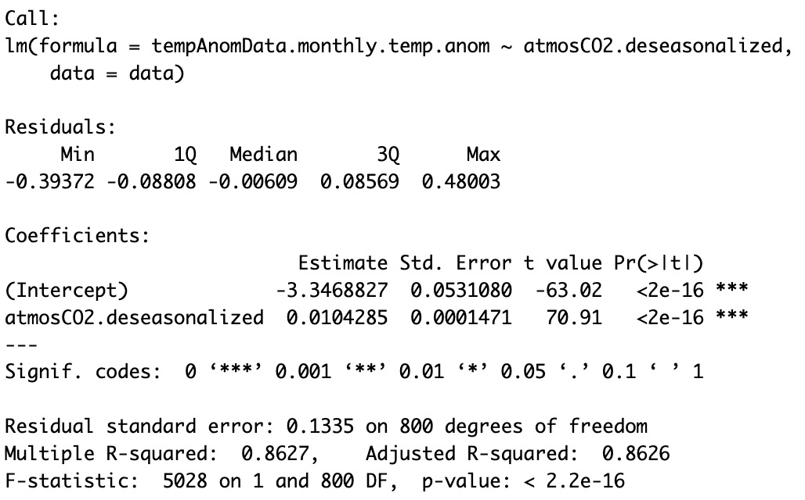
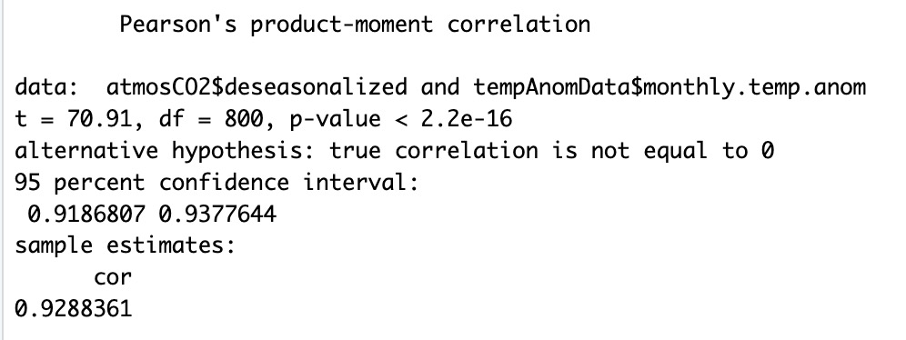
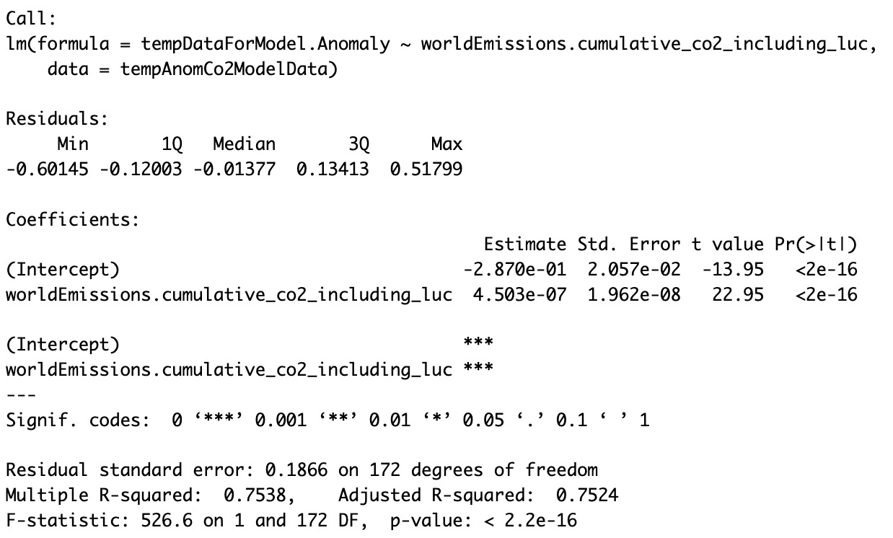
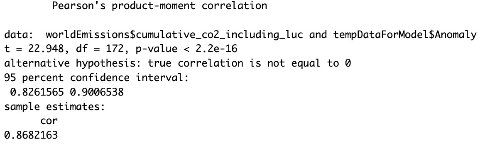

<link rel="stylesheet" href="css/styles.css">

```js
const co2 = FileAttachment("data/CO2_monthly_mean_data.csv").csv()
const anom = FileAttachment("data/GlobalAvgTempAnom.csv").csv()
```

<!-- Navbar HTML Structure -->
<div class="navbar">
    <!-- Left-side navbar content (empty for now) -->
    <div class="logo"><a href="index"></a></div>
    <div>
        <a href="extremeWeather">Extreme Weather</a>
        <a href="mainMap">Surface Temperature</a>
        <a href="ozone">Ozone Layer</a>
        <a href="stackedArea">Energy Sources</a>
        <a href="otherVisualizations">Other Visualizations</a>
        <a href="action" id="action">Take Action</a>
    </div>
</div>

<br><br><br>
<h1 style="font-size: 4em;">Other Visualizations</h1>
<br><br><br>

<!-- -->
<!-- CO2 VISUALIZATION -->
<!-- -->

<h2>Monthly Mean CO<sub>2</sub></h2>

<div class="card">${
resize((width) => Plot.plot({
    title: "Monthly Mean CO2",
    subtitle: "1958-2024",
    width,
    color: {
        scheme: "BuRd"
    },
    x: {
        type: "linear"
    },
    y: {
        label: "Atmospheric Concentration of CO2 (PPM)",
        type: "linear",
        domain: [300, 430]
    },
    marks: [
        Plot.ruleY([0]),
        Plot.dot(co2, {x: "decimal date", y: "average", fill: "average", tip: true}),
        Plot.line(co2, {x: "decimal date", y: "deseasonalized", stroke: "grey", strokeWidth: 2})
    ]
}))
}</div> 
<br><br>

<!-- -->
<!-- TEMP ANOM VISUALIZATION -->
<!-- -->

<h2>Temperature Anomalies</h2>
<div class="card">${
Plot.plot({
    title: "Global Temperature Anomalies",
    width,
    x: {
        type: "linear"
    },
    y: {
        grid: true,
        label: "Surface temperature anomaly (°C)",
        tickFormat: "+C",
        type: "linear"
    },
    color: {
        scheme: "BuRd",
        type: "diverging"
    },
    marks: [
        Plot.ruleY([0]),
        Plot.dot(anom, {
            x: "Year", 
            y: "Anomaly", 
            stroke: "Anomaly", 
            tip: true,
            channels: { Year: "Year"},
            title: (d) => "Date: ${d.Year} \nTemp Anomaly: ${d.Anomaly}"
        })
    ]
})
}</div>

```js

function renderBars(anom) {
  // Select the container div
  const barContainer = document.getElementById("bar-container");

  // Clear any existing content
  barContainer.innerHTML = "";

  // Generate a new Plot
  const newBar = Plot.plot({
    width,
    height: 400,
    color: {
        scheme: "BuRd",
        type: "diverging"
    },
    marks: [
        Plot.barY(anom, {x: "Year", y: "Anomaly", stroke: "Anomaly", tips: true}),
        Plot.gridY({stroke: "black", strokeOpacity: 0.5}),
        Plot.axisX({x: 0}),
        Plot.ruleY([0]),
    ]
  })

  // Append the new plot to the container
  barContainer.appendChild(newBar);
}

renderBars(anom);

```

<div class="card" id="bar-container"></div>
<br><br>

<!-- -->
<!-- RENEWABLE ENERGY VISUALIZATION-->
<!-- -->

<h2>Renewable Energy</h2>
<div class="card">
<label for="yearSlider">Select Year:&emsp;<span id="yearDisplay"></span></label>
<input type="range" id="yearSlider" min="2000" max="2024" step="1">
<br><br>
<canvas id="myChart"></canvas>
</div>
<br><br>

<script src="https://cdn.jsdelivr.net/npm/chart.js"></script>

<script>
    document.addEventListener("DOMContentLoaded", async function () {
    const ctx = document.getElementById('myChart');
    const yearSlider = document.getElementById('yearSlider');
    const yearDisplay = document.getElementById('yearDisplay');

    let energyData = [];

    async function loadCSV() {
        console.log("Fetching CSV data...");
        const response = await fetch('https://raw.githubusercontent.com/proctor18/renewable-energy-data/refs/heads/main/renewable-energy-data.csv');
        const data = await response.text();
        console.log(data);

        const rows = data.split("\n").slice(1);
        energyData = rows.map(row => {
            const [country, code, year, renewablePercent] = row.split(",");
            return {
                country: country.trim(),
                year: parseInt(year.trim(), 10),
                renewablePercent: parseFloat(renewablePercent.trim())
            };
        });

        console.log("Sample Data:", energyData.slice(0, 10));
        populateYearSlider();
    }

    function populateYearSlider() {
        const years = [...new Set(energyData.map(entry => entry.year))].sort();
        
        yearSlider.min = Math.min(...years);
        yearSlider.max = Math.max(...years);
        yearSlider.value = yearSlider.max; 
        yearDisplay.textContent = yearSlider.value;

        updateChart(yearSlider.value);
    }

    function updateChart(selectedYear) {
        console.log(`Updating chart for year: ${selectedYear}`);

        const filteredData = energyData.filter(entry => entry.year === parseInt(selectedYear));

        console.log("Filtered Data:", filteredData);

        const top10 = filteredData.sort((a, b) => b.renewablePercent - a.renewablePercent).slice(0, 10);

        const labels = top10.map(entry => entry.country);
        const values = top10.map(entry => entry.renewablePercent);

        console.log("Chart Labels:", labels);
        console.log("Chart Values:", values);

        if (!ctx) {
            console.error("Canvas context (ctx) is not found.");
            return;
        }

        if (window.myChart instanceof Chart) {
            window.myChart.destroy();
        }

        window.myChart = new Chart(ctx, {
            type: 'bar',
            data: {
                labels: labels,
                datasets: [{
                    label: 'Renewable Energy %',
                    data: values,
                    backgroundColor: 'rgba(75, 192, 192, 0.6)',
                    borderColor: 'rgba(75, 192, 192, 1)',
                    borderWidth: 1
                }]
            },
            options: {
                indexAxis: 'y',
                animation: false, // Disable animation
                scales: {
                    x: { 
                        beginAtZero: true,
                        min: 0,
                        max: 100
                    }
                }
            }
        });

        console.log("Chart Created:", window.myChart);
    }

    yearSlider.addEventListener("input", function () {
        yearDisplay.textContent = this.value;
        updateChart(this.value);
    });

    await loadCSV();
});
</script>

<!-- Regression Results
<div class="card">
    <p>Regression Results Here</p>
    
    
    
    
</div>
-->
<style>

* {
    box-sizing: border-box;  /* Makes padding and borders part of the element's total width/height */
    margin: 0;
    padding: 0;
    /*outline: 1px solid red; /* Highlights all elements */
    align-items: center;
    justify-content: center;
}

html {
  margin: 0 auto;
  padding: 0;
  box-sizing: border-box;
  align-items: center;
  justify-content: center;
}

body {
  margin: 0 auto;
  padding: 0;
  box-sizing: border-box;
  align-items: center;
  justify-content: center;
}

.main {
  margin: 0 auto;
  padding: 0;
  box-sizing: border-box;
  align-items: center;
  justify-content: center;
}

.hero {
  display: flex;
  flex-direction: column;
  align-items: center;
  font-family: var(--sans-serif);
  margin: 4rem 0 8rem;
  text-wrap: balance;
  text-align: center;
}

h1 {
  margin: 0 auto;
  padding: 1rem 0;
  width: 100%;
  max-width: 90%;
  font-size: 5em;
  font-weight: 900;
  line-height: 1;
  text-align: center;
}

.visualization-container {
    width: 70%; /* Makes the container take up 80% of the screen width */
    margin: 0 auto; /* Centers the container */
    display: flex;
    flex-direction: column;
    align-items: center; /* Ensures everything inside is centered horizontally */
    justify-content: center;
}

ul {
    padding-left: 40px; /* Indents the whole list */
}


.text-container {
    display: flex;
    flex-direction: column;
    align-items: flex-start; /* Keeps h2 and p left-aligned */
    text-align: left;
    max-width: 80%; /* Adjust width as needed */
    margin: 0 auto; /* Centers the container */
}


.h2 {
  margin: 0;
  max-width: 34em;
  font-size: 20px;
  font-style: initial;
  font-weight: 500;
  line-height: 1.5;
  color: var(--theme-foreground-muted);
}

p {
  max-width: 90%;
}

@media (min-width: 640px) {
  .hero h1 {
    font-size: 90px;
  }
}

</style>